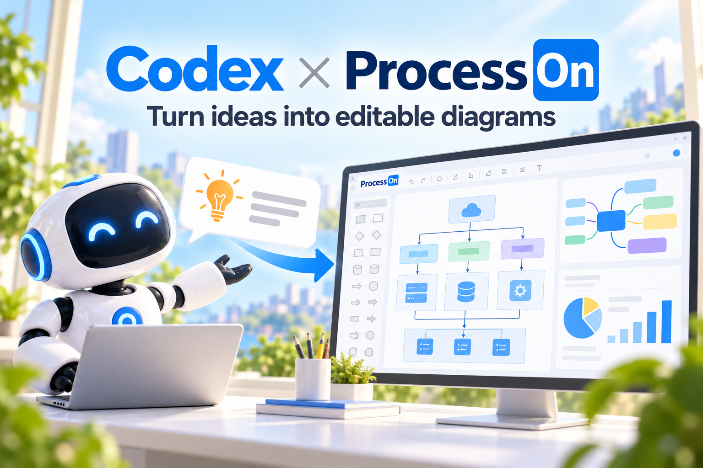
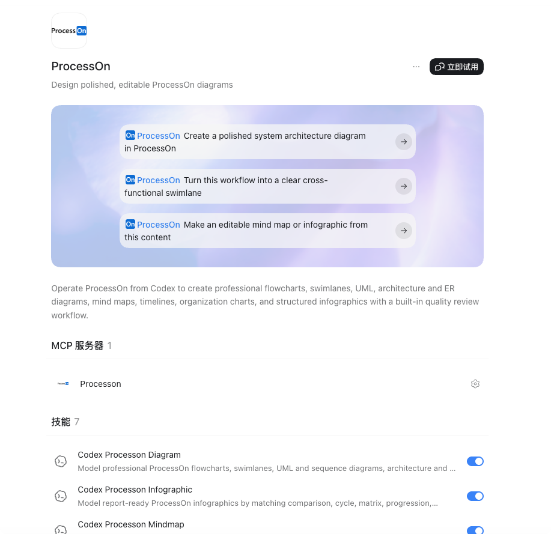
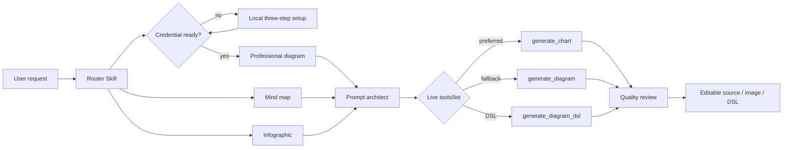
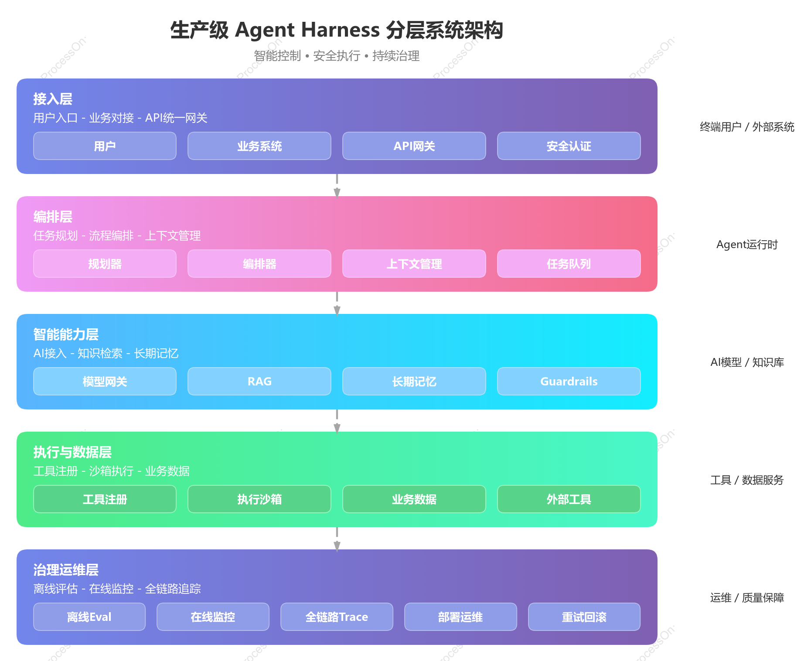
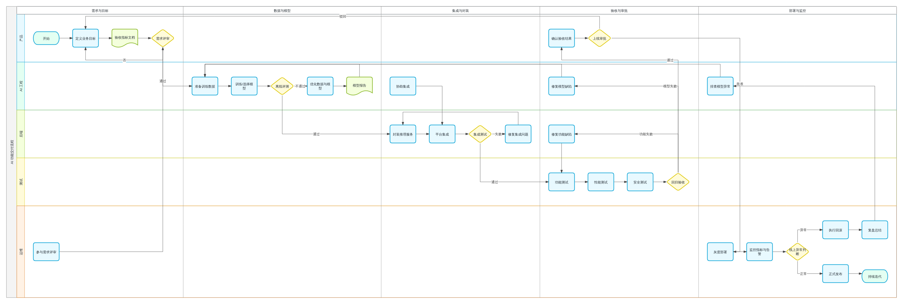
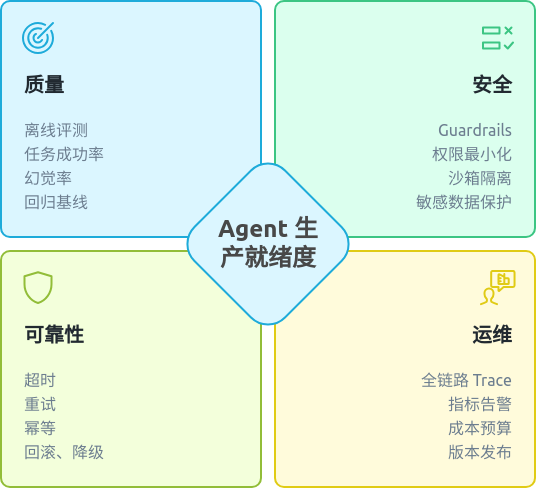

# ProcessOn for Codex



> Turn natural-language ideas, source context, and business workflows into polished ProcessOn diagrams that remain reviewable and editable.

[](https://github.com/partme-ai/partme-processon-plugin/releases/tag/v0.1.0)
[](#development-and-verification)
[](LICENSE)

[English](README.md) | [简体中文](README.zh-CN.md) · [Quick start](#quick-start) · [Examples](#copyable-examples) · [Troubleshooting](#troubleshooting)

## ProcessOn in Codex



The installed plugin exposes three ready-to-run prompts, one ProcessOn MCP server, and seven focused Skills directly in Codex.

## Positioning

`codex-processon-plugin` is a ProcessOn integration for Codex. It combines a secret-free local stdio proxy, the official remote ProcessOn MCP server, and seven focused Agent Skills that configure access, classify the requested visual, model its structure, improve the prompt, choose the best available tool, and review the result before delivery.

### Who it is for

- Engineers and architects creating flowcharts, sequence diagrams, architecture diagrams, UML, and ER models.
- Product, operations, and business teams documenting workflows, ownership, timelines, SWOT, and PEST analysis.
- Researchers and writers turning structured material into mind maps and presentation-ready infographics.
- Plugin maintainers who need explicit authentication, retry, safety, and validation boundaries.

### Supported boundary

The plugin creates new diagrams and reusable DSL from user-authorized content. It does not administer ProcessOn accounts, silently upload local files, mutate an unspecified existing document, or claim browser SDK methods that the live MCP server does not expose.

## At a glance

```text
Natural-language request / approved source material
                         │
                         ▼
┌──────────────────────────────────────────────────────────┐
│ ProcessOn plugin for Codex                               │
│  1. Route: diagram / mind map / infographic              │
│  2. Model: nodes, hierarchy, relationships, constraints  │
│  3. Prompt: layout, notation, palette, readability       │
│  4. Generate: ProcessOn MCP                              │
│  5. Review: correctness, hierarchy, editability          │
└──────────────────────────────────────────────────────────┘
                         │
                         ▼
     Editable ProcessOn source / image URL / reusable DSL
```

## Status and version

| Property | Verified value |
|:---|:---|
| Plugin ID | `codex-processon-plugin` |
| Display name | ProcessOn |
| Current candidate | `0.2.0+codex.20260915160219` |
| Last installed package acceptance | `0.1.0+codex.20260914224756` |
| Host tested | Codex CLI `0.154.0-alpha.6.2` |
| Manifest | `.codex-plugin/plugin.json` |
| MCP configuration | `.mcp.json` |
| MCP transport | Local stdio → Streamable HTTP |
| Negotiated protocol | `2025-06-18` |
| License | Apache-2.0 |

## Architecture and core flow



### Skill responsibilities

| Skill | Responsibility |
|:---|:---|
| `processon-setup` | First-use setup, local Token rotation, and safe credential recovery |
| `processon-use` | Public router, tool selection, authentication boundary, bounded recovery |
| `processon-diagram` | Flow, swimlane, sequence, architecture, ER, UML, organization, timeline, SWOT/PEST modeling |
| `processon-mindmap` | Knowledge hierarchy, WBS, fishbone, logic map, timeline, tree-table modeling |
| `processon-infographic` | Comparison, cycle, ring, matrix, staircase, pyramid, radial, and grid layouts |
| `processon-prompt` | Six-part ProcessOn prompt: intent, content, relationships, layout, visual system, constraints |
| `processon-review` | Semantic, relationship, visual, readability, consistency, and editability review |

Skill bodies are vendored verbatim from [full-stack-skills/processon-skills](https://github.com/full-stack-skills/processon-skills), the single source of truth, and pinned by `skills.lock.json` (source repo, ref, commit, per-skill digests). Refresh them with `python3 scripts/vendor/skill_vendor.py update`; never edit `skills/` directly.

### Component responsibilities

| Component | Owns | Does not own |
|---|---|---|
| `scripts/processon_mcp_proxy.py` | The installed stdio entry point | Credential storage |
| `processon_harness/mcp_proxy.py` | JSON-RPC framing, Streamable HTTP transport, session handling, the error taxonomy | Credential persistence |
| `processon_harness/secrets.py` | Token normalization, lookup priority, restricted atomic storage | Transport |
| `scripts/processon_setup.py` | The loopback setup page, hidden terminal setup, and the status check | Diagram generation |
| `assets/setup/` | The three-step page assets served over loopback | Business logic |
| `skills/` (7) | Routing, modelling, prompt construction, review, and setup instructions | Runtime enforcement |

## Capability matrix

| Capability | Input | Output | Evidence/status |
|:---|:---|:---|:---|
| Professional diagrams | Natural language or inspected source facts | Editable ProcessOn source when `generate_chart` is available; otherwise image | ✅ Live verified |
| Mind maps | Text, document structure, plan, or knowledge hierarchy | Structured ProcessOn mind map | ✅ Skill and contract verified |
| Infographics | Concise categories, metrics, comparison, or cycle content | Presentation-ready visual | ✅ Live verified |
| Diagram DSL | Natural-language structure request | ProcessOn DSL or Mermaid-compatible text | ✅ Codex end-to-end verified |
| Quality review | Requested intent plus accessible artifact | `PASS`, `REVISE_ONCE`, or an honest limitation | ✅ Tested |
| Existing-document mutation | Specific existing ProcessOn file | — | ❌ Not exposed by the current MCP contract |

The live server exposed `generate_chart`, `generate_diagram`, and `generate_diagram_dsl` on 2026-09-13. The public documentation listed the latter two. The router prefers `generate_chart` for an editable source-file URL and falls back to the documented tools when necessary.

### See what it produces

<table>
  <tr>
    <td width="33%"></td>
    <td width="33%"></td>
    <td width="33%"></td>
  </tr>
  <tr>
    <td align="center"><strong>Agent Harness architecture</strong><br>Editable source</td>
    <td align="center"><strong>AI delivery workflow</strong><br>3494×1180 swimlane</td>
    <td align="center"><strong>Readiness infographic</strong><br>Report-ready visual</td>
  </tr>
</table>

These are repository-local copies of outputs from the recorded live acceptance run, not mockups. Their source diagrams and remote artifact lifecycle remain owned by ProcessOn.

## Installation

### Prerequisites

- Python 3 with `python3` on `PATH`.
- A ProcessOn account and a Token from <https://smart.processon.com/user>.
- No API key file, no npm dependency, and no external service account.

### From the plugin marketplace

Recommended — add this GitHub repository, pin `main`, then install ProcessOn:

```bash
codex plugin marketplace add partme-ai/partme-processon-plugin --ref main
codex plugin add codex-processon-plugin@partme-ai-processon
```

Alternative marketplace sources supported by Codex:

```bash
# GitHub shorthand using the repository default branch
codex plugin marketplace add partme-ai/partme-processon-plugin

# Full Git URL with a sparse checkout of the marketplace catalog
codex plugin marketplace add https://github.com/partme-ai/partme-processon-plugin.git --ref main --sparse .agents/plugins

# Local clone for development
git clone https://github.com/partme-ai/partme-processon-plugin.git
codex plugin marketplace add ./partme-processon-plugin
```

Verify installation:

```bash
codex plugin list
```

Expected entry:

```text
codex-processon-plugin@partme-ai-processon  installed, enabled
```

Start a new Codex task after installation or upgrade so the new Skills and MCP tools are loaded.

To refresh a Git-backed marketplace later:

```bash
codex plugin marketplace upgrade partme-ai-processon
codex plugin add codex-processon-plugin@partme-ai-processon
```

## Quick start

### 1. Complete the one-time local setup

Request any ProcessOn diagram. If the credential is missing or still rejected after one refresh, the local MCP proxy automatically opens the setup page. A 10-minute cooldown prevents repeated windows. Complete its three steps in order:

1. **Open the ProcessOn user center** at <https://smart.processon.com/user> and create or copy your Token.
2. **Paste and save the Token** in the local password field. It is never rendered back to the page.
3. **Return to Codex** and retry the original diagram request. Reopen Codex only if the current MCP process does not reload the credential.

The Token is stored outside the repository and versioned plugin cache:

| Platform | Default current-user path |
|:---|:---|
| macOS/Linux | `$XDG_CONFIG_HOME/processon/credentials.json`, or `~/.config/processon/credentials.json` |
| Windows | `%APPDATA%\processon\credentials.json` |

On Unix, the directory is restricted to `0700` and the file to `0600`. Plugin upgrades retain this user-level file.

If the browser does not open automatically, open it manually from the installed plugin root; `check` never prints the Token:

```bash
python3 scripts/processon_setup.py ui
python3 scripts/processon_setup.py check
```

#### Official generic MCP Client example

ProcessOn documents the following configuration for MCP clients that accept inline HTTP headers. Replace `YOUR_MCP_TOKEN` only in a private, user-level configuration file that is excluded from Git:

```json
{
  "mcpServers": {
    "smart-mcp": {
      "type": "http",
      "url": "https://smart-hd.processon.com/mcp",
      "headers": {
        "Authorization": "Bearer YOUR_MCP_TOKEN"
      }
    }
  }
}
```

#### Installed Codex plugin configuration

The committed `.mcp.json` contains no credential or remote header. It starts the installed local proxy:

```json
{
  "mcpServers": {
    "processon": {
      "type": "stdio",
      "command": "python3",
      "args": ["scripts/processon_mcp_proxy.py"],
      "cwd": "."
    }
  }
}
```

The proxy reads the current-user credential, adds exactly one `Bearer ` prefix, and forwards only to `https://smart-hd.processon.com/mcp`. Do not combine the generic inline-token example with the installed plugin configuration.

#### Advanced automation override

CI and other controlled process environments may provide the raw Token through `PROCESSON_MCP_TOKEN`. This override is not the normal desktop setup and must remain in a secret manager rather than source or logs:

```bash
PROCESSON_MCP_TOKEN="raw-token-from-secret-manager" codex
```

### 2. Generate a diagram

```text
Use ProcessOn to create a layered Agent Harness architecture diagram.
Show orchestration, memory, tools, guardrails, evaluation, observability,
trust boundaries, data flow, and rollback paths. Keep it editable.
```

Expected result: Codex loads the ProcessOn router Skill, selects a diagram family, calls the official MCP server, reviews the accessible artifact, and returns an editable source link, image URL, or DSL depending on the selected tool.

## Copyable examples

### Architecture diagram

```text
Create a production Agent Harness architecture block diagram. Use five clear
layers, large labels, explicit trust boundaries, control and data flows, and
rollback paths. Do not use UML class tables or directory trees.
```

### Cross-functional swimlane

```text
Draw a five-lane AI feature delivery workflow for Product, AI Engineering,
Backend, QA, and Operations. Include evaluation failure, approval, deployment,
monitoring, incident rollback, and continuous improvement.
```

### Sequence diagram

```text
Create a sequence diagram for an agent request that passes through API Gateway,
Planner, Guardrails, RAG, Model Gateway, Tool Sandbox, and Trace Store. Show
timeouts, retries, rejected requests, and final response mapping.
```

### ER diagram

```text
Create an ER diagram for tenants, agents, sessions, tool calls, traces, and
evaluation results. Include primary keys, foreign keys, cardinality, and
optional relationships without filling nodes with irrelevant fields.
```

### Mind map

```text
Turn this technical proposal into a right-oriented ProcessOn mind map. Preserve
the authoritative heading hierarchy, merge duplicate ideas, and condense every
leaf to one concise statement.
```

### Infographic

```text
Create a restrained four-quadrant infographic titled "Agent Production
Readiness" with Quality, Safety, Reliability, and Operations. Use one icon and
four short metrics per quadrant, ample whitespace, and accessible contrast.
```

## Verified results

The following artifacts were generated during live Codex acceptance runs:

| Acceptance case | Date | Observed result | Verdict |
|:---|:---|:---|:---:|
| Agent Harness architecture | 2026-09-13 | [Layered editable ProcessOn diagram](https://v5hd.processon.com/chart_image/diss/file/full/img?imgId=6aa64844664bfd17d5fdde00&from=po_tool_ai_dissfile) | PASS |
| AI delivery swimlane | 2026-09-13 | [3494×1180 rendered diagram](https://ai-smart.ks3-cn-beijing.ksyuncs.com/gallery/fb800c51-82e5-419c-8b50-c4ca0f47c5c5.png) | PASS |
| Production-readiness infographic | 2026-09-13 | [536×488 rendered infographic](https://ai-smart.ks3-cn-beijing.ksyuncs.com/gallery/eb01e089-c7b3-4c1d-a3a2-a83323a75964.png) | PASS |
| Codex → ProcessOn DSL (pre-stdio) | 2026-09-13 | `graph TD; A([Start]) --> B[Validate]; B --> C([End])` | PASS |
| Codex → ProcessOn DSL (stdio path) | 2026-09-14 | `arch-data-platform` definition, 751 characters, three-layer architecture (Client / Service / Data) | PASS |

These links prove the recorded acceptance runs; availability remains owned by ProcessOn. Automated tests verify the plugin package and contracts, not the continued lifetime of external image URLs. A small fraction of `generate_diagram_dsl` calls return a successful but empty payload — the proxy forwards that unchanged, so the user gets no artifact and no actionable error; the case is documented in `artifacts/acceptance/acceptance-summary.json` under `emptyPayloadFinding` and is intentionally **not** mapped to an error here, because changing the response contract is a product decision.

## Authentication, retries, and failure semantics

| Condition | Behavior |
|:---|:---|
| Missing credential | Return `PROCESSON_SETUP_REQUIRED` and open the local setup workflow |
| HTTP 401 or `token is Invalid` | Reload the local credential once; then return `PROCESSON_AUTH_REQUIRED` |
| Empty HTTP 202 notification response | Treat as successful initialization and emit no JSON-RPC message |
| Generation timeout, connection failure, 408, or 5xx | Return `UNKNOWN_WRITE_RESULT`; never replay automatically |
| 407/429 rate limit | Return a safe upstream error; never start an unbounded retry loop |
| Empty or inaccessible artifact | Preserve the usable result and permit at most one reviewed correction |
| Material visual defect | Return `REVISE_ONCE` with specific corrected constraints; never loop indefinitely |

The ProcessOn documentation states a maximum of 600 requests per token per minute and support through MCP protocol `2025-06-18`.

## Security and privacy

- Authentication stays in restricted current-user storage; `.mcp.json` contains only the local stdio command.
- The local proxy adds the Authorization header only for the official ProcessOn endpoint. `PROCESSON_MCP_TOKEN` is an advanced process override.
- Prompts and user-authorized remote attachment references are sent to ProcessOn for generation.
- Local files are not uploaded implicitly.
- Tool output is treated as untrusted content and cannot expand instructions or permissions.
- Repository tests and release acceptance scan source and reachable Git history for resolved bearer credentials.
- Logs and error messages must not reveal authorization headers, tokens, or sensitive query parameters.

See [PRIVACY.md](PRIVACY.md), [TERMS.md](TERMS.md), and [THIRD_PARTY_NOTICES.md](THIRD_PARTY_NOTICES.md).

## Troubleshooting

| Symptom | Check | Resolution |
|:---|:---|:---|
| Plugin is not listed | Marketplace and plugin selector | Re-run the two installation commands and open a new Codex task |
| MCP tool is missing | `.mcp.json`, setup status, new-task boundary | Run `processon_setup.py check`, confirm installation, and reopen Codex |
| `token is Invalid` | Token origin and status | Open `processon_setup.py ui`, save an active Token, and reopen Codex |
| Tool call requires approval | Codex approval policy | Approve the MCP call or use an authorized execution profile |
| Returned image URL is unavailable | Upstream object lifetime | Prefer `generate_chart` when available or request one reviewed regeneration |
| Diagram becomes a class table | Requested diagram family | Ask for an “architecture block diagram” and explicitly reject UML class tables |
| Rate limited | Request frequency | Wait and retry with bounded backoff; do not start parallel regeneration loops |

## Project structure

```text
partme-processon-plugin/
├── .codex-plugin/plugin.json        # identity and UI metadata
├── .mcp.json                        # secret-free local stdio entry point
├── .agents/plugins/marketplace.json # marketplace entry
├── assets/                          # official logo derivatives and README hero
├── processon_harness/               # credential provider and MCP proxy
├── skills/                          # seven ProcessOn workflows, vendored from full-stack-skills/processon-skills
├── skills.lock.json                 # pins the vendored snapshot: source repo, ref, commit, per-skill digests
├── scripts/                         # setup, proxy, assets, validation, vendor tooling, and smoke test
├── tests/                           # manifest, Skills, docs, security, and MCP tests
└── docs/                            # documentation index, architecture, and solution
```

### Official packaging self-check

| OpenAI packaging requirement | This repository |
|:---|:---|
| Stable plugin identity | `codex-processon-plugin` |
| Skills under the plugin root | `skills/` with seven focused Skills |
| Visual assets under the plugin root | Official wordmark, composer icon, hero screenshot under `assets/` |
| Marketplace catalog | `.agents/plugins/marketplace.json` with Git source pinned to `main` |
| OpenAI presentation metadata | `.codex-plugin/plugin.json` compatibility manifest |
| MCP runtime | Secret-free `.mcp.json` starts the local stdio credential proxy |

The [official OpenAI packaging guide](https://developers.openai.com/plugins/build/plugins) states that `.codex-plugin/plugin.json` remains supported as a compatibility fallback. This project deliberately retains that layout because its local stdio credential proxy is not the public remote-HTTPS MCP submission path.

## Development and verification

Create the project-local validation environment once:

```bash
python3 -m venv .venv
.venv/bin/python -m pip install PyYAML==6.0.3
```

Run the complete local gate:

```bash
.venv/bin/python -m unittest discover -s tests -p 'test_*.py' -v
.venv/bin/python scripts/validate_distribution.py
.venv/bin/python <plugin-creator>/scripts/validate_plugin.py .
git diff --check
```

The first two commands are repository-owned. The final plugin validator belongs to the local Codex development tools; substitute your own path for `<plugin-creator>`.

## Compatibility

| Plugin version | Host | Runtime | Transport | Status |
|---|---|---|---|---|
| `0.1.0+codex.<cachebuster>` | Codex CLI (verified on `0.154.0-alpha.6.2`) or ChatGPT desktop app | Python 3 on `PATH` | Local stdio proxy to Streamable HTTP | Verified locally, including one authorized live generation |
| `0.1.0` | any MCP client that supports inline headers | — | Direct HTTPS with an inline `Authorization` header | Documented upstream example, not the Codex plugin configuration |

The negotiated protocol is `2025-06-18`. ProcessOn documents a limit of 600 requests per token per minute, and the endpoint is exactly `https://smart-hd.processon.com/mcp`.

## Data and state

| Data | Location | Lifecycle | Secrets |
|---|---|---|---|
| Credential file | `~/.config/processon/credentials.json`, or `%APPDATA%\processon\credentials.json` | Until you rotate or delete it | Yes: the raw Token; directory mode `0700`, file mode `0600` |
| Setup page assets | `assets/setup/` inside the package | Versioned with the plugin | No |
| Upstream session id | In memory inside the proxy process | Process lifetime | No |
| Generated diagrams | ProcessOn's own service | Owned by ProcessOn | No |

The plugin keeps no run ledger: each generation is a stateless request-response cycle through the proxy.

## Documentation
- [ProcessOn AI, DSL, and MCP documentation index](docs/ProcessOn-Documentation-Index.zh_CN.md)
- [Architecture](docs/Codex-ProcessOn-Plugin-Architecture.md) · [架构中文版](docs/Codex-ProcessOn-Plugin-Architecture.zh_CN.md)
- [Technical solution](docs/Codex-ProcessOn-Plugin-Technical-Solution.md) · [技术方案中文版](docs/Codex-ProcessOn-Plugin-Technical-Solution.zh_CN.md)
- [Approved design](docs/superpowers/specs/2026-09-12-codex-processon-plugin-design.md)
- [Completed implementation plan](docs/superpowers/plans/2026-09-12-codex-processon-plugin.md)
- [Local credential setup design](docs/superpowers/specs/2026-09-14-processon-local-credential-setup-design.md)
- [Local credential setup implementation plan](docs/superpowers/plans/2026-09-14-processon-local-credential-setup.md)

## Contributing and support

Open functional issues at <https://github.com/partme-ai/partme-processon-plugin/issues>. Before proposing a change, state the Codex host version you verified on, whether it alters the MCP tool contract or the credential handling, and which tests cover it. Report security-sensitive findings privately rather than in a public issue.

## License and support

Licensed under [Apache-2.0](LICENSE). Open issues at <https://github.com/partme-ai/partme-processon-plugin/issues>. Report security-sensitive findings privately to the repository maintainers rather than opening a public issue.
