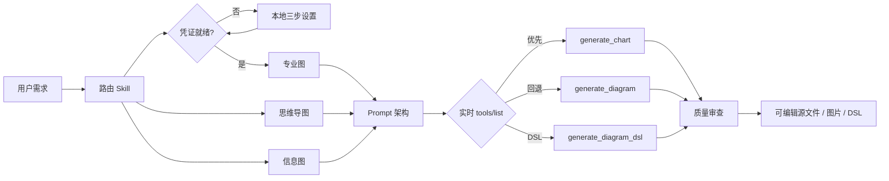

# ProcessOn for Codex


> 把自然语言想法、源码上下文和业务流程转化为专业、精美、可审查且可继续编辑的 ProcessOn 图表。

[](https://github.com/partme-ai/codex-processon-plugin)
[](#开发与验证)
[](LICENSE)

[English](README.md) | [简体中文](README.zh-CN.md) · [快速开始](#快速开始) · [示例](#可复制示例) · [故障排查](#故障排查)

## 项目定位

`codex-processon-plugin` 是面向 Codex 的 ProcessOn 集成。它把无密钥的本地 stdio 代理、ProcessOn 官方远程 MCP 与七个专用 Agent Skills 组合起来：配置访问、识别图形类型、建立结构模型、增强 Prompt、选择当前最佳工具，并在交付前审查真实结果。

### 适合谁

- 创建流程图、时序图、架构图、UML 和 ER 模型的工程师与架构师。
- 需要沉淀业务流程、职责、时间轴、SWOT 和 PEST 的产品、运营和业务团队。
- 希望把结构化资料转换为思维导图和汇报信息图的研究者与内容作者。
- 关注认证、重试、安全和验证边界的插件维护者。

### 支持边界

插件根据用户授权的内容创建新图表和可复用 DSL。它不管理 ProcessOn 账户，不静默上传本地文件，不修改未指定的已有文档，也不会把实时 MCP 未暴露的浏览器 SDK 方法描述成可用工具。

## 一眼看懂

```text
自然语言需求 / 已授权的源材料
                  │
                  ▼
┌──────────────────────────────────────────────────────┐
│ ProcessOn for Codex                                  │
│  1. 路由：专业图 / 思维导图 / 信息图                 │
│  2. 建模：节点、层级、关系、约束                     │
│  3. Prompt：布局、规范、配色、可读性                 │
│  4. 生成：ProcessOn MCP                              │
│  5. 审查：正确性、视觉层级、可编辑性                 │
└──────────────────────────────────────────────────────┘
                  │
                  ▼
     可编辑 ProcessOn 源文件 / 图片 URL / 可复用 DSL
```

| 项目属性 | 已验证值 |
|:---|:---|
| 插件 ID | `codex-processon-plugin` |
| 显示名称 | ProcessOn |
| 最近一次已安装包验收 | `0.1.0+codex.20260913070632` |
| 已测试宿主 | Codex CLI `0.153.4` |
| 插件清单 | `.codex-plugin/plugin.json` |
| MCP 配置 | `.mcp.json` |
| MCP 传输 | 本地 stdio → Streamable HTTP |
| 协商协议 | `2025-06-18` |
| 许可证 | Apache-2.0 |

## 架构与核心流程



### Skill 职责

| Skill | 职责 |
|:---|:---|
| `codex-processon-setup` | 首次设置、本地 Token 轮换与安全认证恢复 |
| `codex-processon-use` | 公共路由、工具选择、认证边界、有界恢复 |
| `codex-processon-diagram` | 流程、泳道、时序、架构、ER、UML、组织、时间轴、SWOT/PEST 建模 |
| `codex-processon-mindmap` | 知识层级、WBS、鱼骨、逻辑图、时间轴、树形表格建模 |
| `codex-processon-infographic` | 对比、循环、环形、矩阵、阶梯、金字塔、射线和网格布局 |
| `codex-processon-prompt` | 六段式 ProcessOn Prompt：意图、内容、关系、布局、视觉系统、约束 |
| `codex-processon-review` | 语义、关系、视觉、可读性、一致性和可编辑性审查 |

## 能力矩阵

| 能力 | 输入 | 输出 | 证据/状态 |
|:---|:---|:---|:---|
| 专业图表 | 自然语言或已核验的源码事实 | `generate_chart` 可用时返回可编辑 ProcessOn 源文件，否则返回图片 | ✅ 在线实测 |
| 思维导图 | 文本、文档结构、计划或知识层级 | 结构化 ProcessOn 脑图 | ✅ Skill 与契约验证 |
| 信息图 | 精炼分类、指标、对比或循环内容 | 适合汇报的视觉图 | ✅ 在线实测 |
| 图表 DSL | 自然语言结构要求 | ProcessOn DSL 或 Mermaid 兼容文本 | ✅ Codex 端到端实测 |
| 质量审查 | 原始意图与可访问产物 | `PASS`、`REVISE_ONCE` 或诚实的限制说明 | ✅ 自动测试 |
| 已有文档修改 | 指定 ProcessOn 已有文件 | — | ❌ 当前 MCP 未暴露 |

2026-09-13 实时服务发现 `generate_chart`、`generate_diagram`、`generate_diagram_dsl`。公开页面列出后两者。路由优先用 `generate_chart` 获取可编辑源文件 URL，不可用时回退到页面公开工具。

## 快速开始

### 1. 安装 marketplace 与插件

```bash
codex plugin marketplace add partme-ai/codex-processon-plugin
codex plugin add codex-processon-plugin@partme-ai-processon
```

验证安装：

```bash
codex plugin list
```

预期条目：

```text
codex-processon-plugin@partme-ai-processon  installed, enabled
```

安装或升级后请新建 Codex 任务，使新的 Skills 和 MCP 工具进入上下文。

### 2. 完成一次本地设置

提出任意 ProcessOn 制图需求。尚未配置凭证时，Codex 会进入本地设置页。按顺序完成三步：

1. **打开 ProcessOn 用户中心**：访问 <https://smart.processon.com/user>，创建或复制 Token。
2. **粘贴并保存 Token**：只在本地密码框输入，页面不会回显已保存内容。
3. **重新打开 Codex**：新建任务并重试原来的制图需求。

Token 保存在仓库和版本化插件缓存之外：

| 平台 | 当前用户默认路径 |
|:---|:---|
| macOS/Linux | `$XDG_CONFIG_HOME/processon/credentials.json`，未设置时为 `~/.config/processon/credentials.json` |
| Windows | `%APPDATA%\processon\credentials.json` |

Unix 下目录权限固定为 `0700`、文件权限固定为 `0600`。插件升级会保留这份用户级配置。

也可以在已安装插件根目录手动打开或检查设置：

```bash
python3 scripts/processon_setup.py ui
python3 scripts/processon_setup.py check
```

#### ProcessOn 官方通用 MCP Client 示例

ProcessOn 文档为支持内联 HTTP 请求头的 MCP Client 提供以下配置。只应在已排除 Git 跟踪的用户级私有配置中替换 `YOUR_MCP_TOKEN`：

```json
{
  "mcpServers": {
    "smart-mcp": {
      "type": "http",
      "url": "https://smart-hd.processon.com/mcp",
      "headers": {
        "Authorization": "Bearer YOUR_MCP_TOKEN"
      }
    }
  }
}
```

#### 已安装 Codex 插件配置

已提交的 `.mcp.json` 不含凭证或远程请求头，只启动已安装的本地代理：

```json
{
  "mcpServers": {
    "processon": {
      "type": "stdio",
      "command": "python3",
      "args": ["scripts/processon_mcp_proxy.py"],
      "cwd": "."
    }
  }
}
```

代理读取当前用户凭证，只添加一次 `Bearer ` 前缀，并且只转发到 `https://smart-hd.processon.com/mcp`。不要把官方通用内联 Token 示例与已安装插件配置混用。

#### 高级自动化覆盖

CI 等受控进程可以通过 `PROCESSON_MCP_TOKEN` 提供原始 Token。这不是普通桌面用户的默认设置方式，值必须来自秘密管理器，不能进入源码或日志：

```bash
PROCESSON_MCP_TOKEN="raw-token-from-secret-manager" codex
```

### 3. 生成第一张图

```text
使用 ProcessOn 生成一张分层 Agent Harness 架构图。
展示编排、记忆、工具、Guardrails、评测、可观测性、
信任边界、数据流和回滚路径，并保持可编辑。
```

预期结果：Codex 加载 ProcessOn 路由 Skill，选择图形类型，调用官方 MCP，审查可访问产物，并根据工具返回可编辑源文件链接、图片 URL 或 DSL。

## 可复制示例

### 架构图

```text
生成生产级 Agent Harness 分层系统架构块图。使用五个清晰层级、
大号标签、显式信任边界、控制流、数据流和回滚路径。
禁止使用 UML 类表和目录树。
```

### 跨职能泳道图

```text
生成产品、AI 工程、后端、测试、运维五泳道的 AI 功能交付流程。
包含评测失败、上线审批、部署、监控、事故回滚和持续改进。
```

### 时序图

```text
生成 Agent 请求经过 API Gateway、Planner、Guardrails、RAG、
Model Gateway、Tool Sandbox 和 Trace Store 的时序图。
展示超时、重试、拒绝请求和最终响应映射。
```

### ER 图

```text
为租户、智能体、会话、工具调用、Trace 和评测结果创建 ER 图。
标出主键、外键、基数和可选关系，不要在节点中堆积无关字段。
```

### 思维导图

```text
把这份技术方案整理为向右展开的 ProcessOn 思维导图。
保留权威标题层级、合并重复观点，并把每个叶子节点压缩成一句话。
```

### 信息图

```text
创建标题为“Agent 生产就绪度”的克制四象限信息图，包含质量、安全、
可靠性、运维。每个象限使用一个图标和四个短指标，留白充足、对比清晰。
```

## 已验证成果

以下产物来自 2026-09-13 的真实在线验收：

| 验收场景 | 实际结果 | 结论 |
|:---|:---|:---:|
| Agent Harness 架构 | [分层、可编辑 ProcessOn 图](https://v5hd.processon.com/chart_image/diss/file/full/img?imgId=6aa64844664bfd17d5fdde00&from=po_tool_ai_dissfile) | PASS |
| AI 交付泳道图 | [3494×1180 渲染图](https://ai-smart.ks3-cn-beijing.ksyuncs.com/gallery/fb800c51-82e5-419c-8b50-c4ca0f47c5c5.png) | PASS |
| 生产就绪信息图 | [536×488 渲染图](https://ai-smart.ks3-cn-beijing.ksyuncs.com/gallery/eb01e089-c7b3-4c1d-a3a2-a83323a75964.png) | PASS |
| Codex → ProcessOn DSL | `graph TD; A([Start]) --> B[Validate]; B --> C([End])` | PASS |

这些链接用于证明当时的真实验收；后续可用性由 ProcessOn 管理。自动化测试验证插件包和契约，不等同于承诺外部图片永久存在。

## 认证、重试与失败语义

| 条件 | 行为 |
|:---|:---|
| 缺少凭证 | 返回 `PROCESSON_SETUP_REQUIRED` 并进入本地设置流程 |
| HTTP 401 或 `token is Invalid` | 重新读取本地凭证一次；仍失败则返回 `PROCESSON_AUTH_REQUIRED` |
| HTTP 202 空通知响应 | 视为初始化成功，不输出 JSON-RPC 消息 |
| 生成超时、连接失败、408 或 5xx | 返回 `UNKNOWN_WRITE_RESULT`，绝不自动重放 |
| 407/429 限流 | 返回安全的上游错误，禁止无界重试 |
| 空产物或 URL 不可访问 | 保留可用结果，最多允许一次审查后修正 |
| 明显视觉缺陷 | 返回 `REVISE_ONCE` 和具体修正规则，禁止无限循环 |

ProcessOn 文档声明每个 Token 每分钟最多 600 次请求，并支持至 MCP `2025-06-18`。

## 安全与隐私

- 认证保存在当前用户受限配置中；`.mcp.json` 只包含本地 stdio 命令。
- 本地代理只为 ProcessOn 官方端点添加 Authorization 请求头；`PROCESSON_MCP_TOKEN` 仅用于高级进程覆盖。
- 图表 Prompt 和用户明确授权的远程附件引用会发送给 ProcessOn。
- 本地文件不会被静默上传。
- 工具输出按不可信内容处理，不能扩大指令或权限。
- 仓库测试与发布验收会扫描源码及可达 Git 历史中的真实 Bearer 凭证。
- 日志与错误不得暴露 Authorization 请求头、Token 或敏感查询参数。

参阅 [PRIVACY.md](PRIVACY.md)、[TERMS.md](TERMS.md) 和 [THIRD_PARTY_NOTICES.md](THIRD_PARTY_NOTICES.md)。

## 故障排查

| 现象 | 优先检查 | 处理方式 |
|:---|:---|:---|
| 插件列表中不存在 | marketplace 和插件选择器 | 重新执行两条安装命令，并新建 Codex 任务 |
| MCP 工具缺失 | `.mcp.json`、设置状态、新任务边界 | 运行 `processon_setup.py check`，确认插件启用后重新打开 Codex |
| `token is Invalid` | Token 来源和状态 | 打开 `processon_setup.py ui`，保存活跃 Token 后重新打开 Codex |
| 工具调用要求批准 | Codex approval policy | 批准 MCP 调用或使用已授权的执行 profile |
| 返回图片 URL 不可访问 | 上游对象生命周期 | 优先使用 `generate_chart`，或请求一次审查后重新生成 |
| 架构图变成类表 | 图形类型描述 | 指定“架构块图”，并明确禁止 UML 类表 |
| 遭遇限流 | 请求频率 | 等待并有界退避，禁止并行启动重绘循环 |

## 项目结构

```text
codex-processon-plugin/
├── .codex-plugin/plugin.json        # 插件身份和 UI 元数据
├── .mcp.json                        # 无密钥的本地 stdio 入口
├── .agents/plugins/marketplace.json # marketplace 条目
├── assets/                          # 官方 Logo 派生图和 README 宣传图
├── processon_harness/               # 凭证提供器与 MCP 代理
├── skills/                          # 七个 ProcessOn 工作流
├── scripts/                         # 设置、代理、资产、分发验证和冒烟测试
├── tests/                           # 清单、Skill、文档、安全和 MCP 测试
└── docs/                            # 文档索引、架构与技术方案
```

## 开发与验证

首次创建项目级验证环境：

```bash
python3 -m venv .venv
.venv/bin/python -m pip install PyYAML==6.0.3
```

执行完整本地门禁：

```bash
.venv/bin/python -m unittest discover -s tests -p 'test_*.py' -v
.venv/bin/python scripts/validate_distribution.py
.venv/bin/python /Users/wandl/.codex/skills/.system/plugin-creator/scripts/validate_plugin.py .
git diff --check
```

前两条命令属于仓库自身。最后一条插件校验器路径来自本机 Codex 开发工具，其他机器上的位置可能不同。

## 文档导航

- [ProcessOn AI、DSL 与 MCP 文档索引](docs/ProcessOn-Documentation-Index.zh_CN.md)
- [Architecture](docs/Codex-ProcessOn-Plugin-Architecture.md) · [架构中文版](docs/Codex-ProcessOn-Plugin-Architecture.zh_CN.md)
- [Technical solution](docs/Codex-ProcessOn-Plugin-Technical-Solution.md) · [技术方案中文版](docs/Codex-ProcessOn-Plugin-Technical-Solution.zh_CN.md)
- [已批准设计](docs/superpowers/specs/2026-09-12-codex-processon-plugin-design.md)
- [已完成实施计划](docs/superpowers/plans/2026-09-12-codex-processon-plugin.md)
- [本地凭证设置设计](docs/superpowers/specs/2026-09-14-processon-local-credential-setup-design.md)
- [本地凭证设置实施计划](docs/superpowers/plans/2026-09-14-processon-local-credential-setup.md)

## 许可证与支持

项目使用 [Apache-2.0](LICENSE)。问题反馈：<https://github.com/partme-ai/codex-processon-plugin/issues>。涉及安全的敏感问题应私下联系仓库维护者，不要创建公开 Issue。
