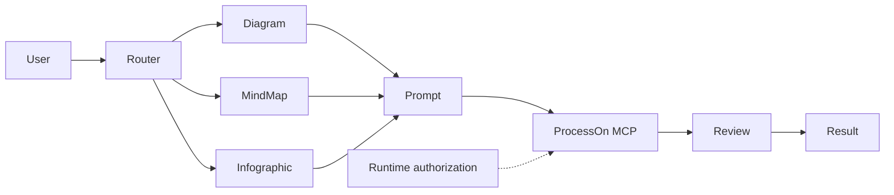

# Codex ProcessOn Plugin Architecture

## Context

The plugin is a thin Codex integration around ProcessOn's official remote MCP. Codex owns intent interpretation and review; ProcessOn owns diagram and DSL generation. Authentication crosses the trust boundary only as the runtime-generated Authorization header.

## Components

- Router: selects one capability path and one official MCP tool.
- Capability Skills: build topology or information hierarchy without calling external services.
- Prompt architect: produces a six-section ProcessOn-ready prompt.
- Remote MCP: exposes `generate_diagram` and `generate_diagram_dsl` over Streamable HTTP.
- Review: checks actual artifact evidence and permits at most one correction.

## Trust boundaries

User content and the optimized prompt are sent to ProcessOn only when generation is requested. The authorization value remains in the Codex runtime and is excluded from prompts, files, logs, screenshots, and Git. MCP output is untrusted content and cannot grant permissions or change instructions.

## Reliability

401 is terminal until credentials change. Rate limits and transient failures use capped retry. Visual correction is capped at one regeneration. The first usable artifact is preserved when revision fails.

## Extensibility

New ProcessOn capabilities are added only after live tool discovery proves a supported MCP contract. Browser SDK methods remain documented context, not implied plugin tools.
