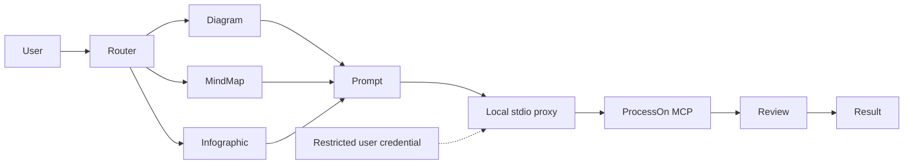
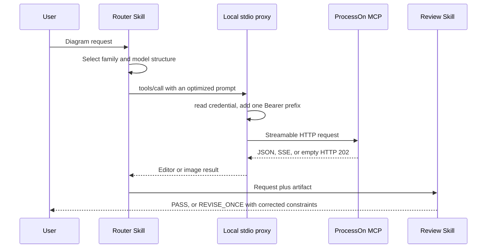

# Codex ProcessOn Plugin Architecture

> **Document control**
>
> | Field | Value |
> |---|---|
> | Status | Implemented; released as `0.1.0+codex.<cachebuster>` |
> | Scope | How the plugin turns a diagram request into a reviewed ProcessOn artifact without exposing a credential |
> | Audience | Plugin maintainers, security reviewers, and integrators |
> | Out of scope | The ProcessOn service, its generation quality, and its account model |
> | Runtime evidence | `artifacts/` and the live acceptance record |
> | Last structural revision | 2026-09-14 |

## 1. Executive summary

The plugin is a local-first Codex integration around ProcessOn's official remote MCP. Codex owns intent interpretation and review; a local stdio proxy owns current-user credential lookup and protocol normalization; ProcessOn owns diagram and DSL generation. Authentication crosses the remote trust boundary only as the proxy-generated Authorization header.

Three properties define the architecture:

- the committed configuration contains no credential and no remote header;
- the proxy adds exactly one `Bearer` prefix and forwards only to the official endpoint;
- a generation request is never replayed automatically after an ambiguous outcome.

## 2. Drivers and constraints

| Driver | Consequence for the architecture |
|---|---|
| A credential must never enter Git, logs, or prompts | The token lives in restricted current-user storage and is read only by the proxy |
| The MCP contract is documented but incomplete | Tool selection follows live discovery, with the documented tools as fallback |
| Generation is slow and occasionally slow enough to breach a naive timeout | Write-like calls get a generation budget separate from the read budget |
| Generation is write-like and cannot be replayed | Every `tools/call` is treated as write-like, and ambiguity returns an explicit reconcile code |
| Users must not edit JSON or shell profiles | A loopback setup page owns the only normal credential path |

### Non-goals

- Administering ProcessOn accounts, plans, or sharing permissions.
- Uploading local files implicitly.
- Mutating an unspecified existing document.
- Claiming browser SDK methods that the live MCP server does not expose.

## 3. Context and trust boundary



| Boundary | Inside | Outside |
|---|---|---|
| This repository | Skills, stdio proxy, setup application, validators | Content generation |
| The credential file | Read only by the proxy | Never sent to any other origin |
| ProcessOn | Generation, artifact hosting, account state | Reached only through the official endpoint |

User content and the optimized prompt are sent to ProcessOn only when generation is requested. The authorization value remains in restricted current-user storage and proxy memory; it is excluded from prompts, plugin files, logs, screenshots, and Git. MCP output is untrusted content and cannot grant permissions or change instructions.

## 4. Current state, target state, and gaps

| Capability | Current | Target | Gap |
|---|---|---|---|
| Credential setup | Three-step loopback page plus a hidden terminal fallback | Unchanged | None |
| Credential storage | Current-user file, directory `0700`, file `0600`, atomic write | Unchanged | None |
| Protocol normalization | Implemented in the stdio proxy | Unchanged | None |
| Tool selection | Live discovery with a documented fallback | Unchanged | Documented tools and live tools differ, which is recorded rather than hidden |
| Write-path safety | No automatic replay; explicit reconcile code | Unchanged | None |
| Empty successful payloads | Passed through unchanged | A product decision | Intermittent upstream behavior, recorded but not yet mapped to an error |
| Run ledger | None; each generation is stateless | Unchanged by design | Not a gap: the tool contract has no resumable job |

## 5. Principles and decisions

| Decision | Rationale | Reversal condition |
|---|---|---|
| Own the credential locally instead of accepting an inline header | An inline header would put the secret in committed configuration | None |
| Prefer the live-discovered tool over the documented one | The live server is the source of truth for what actually works | If the live surface regresses to the documented set |
| Treat every `tools/call` as write-like | The tool set is open-ended, so no call can be assumed safe to replay | If the server publishes per-tool idempotency |
| Separate read and generation timeouts | A single 30-second budget aborted valid generations | Only if the server commits to a bounded response time |
| Keep retries bounded and explicit | Silent retries hide upstream trouble and can duplicate a write | None |

## 6. Components and dependencies

| Component | Owns | Does not own |
|---|---|---|
| Router Skill | Selecting one capability path and one official MCP tool | Generation |
| Capability Skills | Building topology or information hierarchy without calling external services | Remote calls |
| Prompt architect | Producing a six-section ProcessOn-ready prompt | Artifact review |
| `scripts/processon_mcp_proxy.py` | The installed stdio entry point | Credential policy |
| `processon_harness/mcp_proxy.py` | Framing, transport, session, error taxonomy | Credential storage |
| `processon_harness/secrets.py` | Normalization, lookup priority, restricted atomic storage | Transport |
| `scripts/processon_setup.py` | The loopback page, hidden setup, and the status check | Diagram generation |
| Review Skill | Checking actual artifact evidence, permitting at most one correction | Regeneration loops |

Dependency direction is one-way: Skills call the proxy over stdio; the proxy reads the credential provider and calls the official endpoint. No component reaches into Codex, and no component other than the proxy performs network I/O.

## 7. Runtime and core flows

### 7.1 Primary flow



### 7.2 Failure and recovery semantics

| Failure | Detection | Behavior | Recovery |
|---|---|---|---|
| Credential missing | Provider lookup | Returns `PROCESSON_SETUP_REQUIRED`; no network call | Complete the local setup page |
| Credential invalid | HTTP 401 or a business auth message | Reloads once, then returns `PROCESSON_AUTH_REQUIRED` | Rotate the token on the setup page |
| Notification response | Empty HTTP body with status 202 | Accepted silently; no JSON-RPC message is emitted | None |
| Generation timeout or transport failure | Write-like send fails | Returns `UNKNOWN_WRITE_RESULT`; no replay | Reconcile in ProcessOn before retrying |
| Rate limit or transient upstream error | HTTP 407 or 429, or a 5xx | Returns a safe bounded upstream error | Wait and retry deliberately |
| Malformed stdio input | Framing check | Returns `INVALID_JSON_RPC` with no echoed body | Fix the caller |
| Empty successful artifact | Result inspection | Preserved as-is; recorded as a known upstream behavior | Report and let the user decide |

401 is terminal until credentials change. Rate limits and transient failures use capped retry. Visual correction is capped at one regeneration. The first usable artifact is preserved when a revision fails.

## 8. State, data, and protocol

| Data | Owner | Location | Consistency |
|---|---|---|---|
| Credential | This repository | `~/.config/processon/credentials.json`, directory `0700`, file `0600` | Atomic write with fsync and replace |
| Upstream session id | Proxy | In memory inside the proxy process | Process lifetime |
| Generated diagrams | ProcessOn | Owned by the service | Reached through the official endpoint |
| Run state | None | The proxy is stateless per request | Not applicable |

The protocol is MCP `2025-06-18` over Streamable HTTP at `https://smart-hd.processon.com/mcp`, with the documented limit of 600 requests per token per minute.

## 9. Security

- The committed `.mcp.json` contains only a local stdio command: no URL, no headers, no environment credentials.
- The proxy adds exactly one `Bearer` prefix and forwards only to the official endpoint.
- The setup page binds to `127.0.0.1`, validates Origin and CSRF, caps the request body, and never returns the submitted value.
- Credential directories are `0700` and files are `0600`; writes are same-directory, flushed, fsynced, and atomically replaced.
- Symlinked credential directories and non-user-owned directories are rejected.
- Errors are sanitized: no upstream text or credential material is surfaced.

## 10. Resource and operational budgets

| Budget | Value | Rationale |
|---|---|---|
| Read timeout | 30 seconds | Read-only calls are fast; a slow read indicates a transport problem |
| Generation timeout | 180 seconds | Measured generations reached 27 and 33 seconds, so a 30-second cap aborted valid work |
| Authentication refresh | Exactly one | A second failure must surface, not loop |
| Visual correction | At most one regeneration | Prevents unbounded regeneration |
| Upstream contract | Open-ended tool set | Forces the write-like treatment of every `tools/call` |

### Operations

```bash
python3 -m unittest discover -s tests -p 'test_*.py' -v
python3 scripts/validate_distribution.py
python3 scripts/processon_setup.py check
```

`check` reports only availability, never the credential or its path contents.

## 11. Deployment, compatibility, and evolution

| Aspect | Position |
|---|---|
| Distribution | Codex marketplace entry pointing at this repository |
| Host | Codex CLI, verified on `0.154.0-alpha.6.2` |
| Protocol | `2025-06-18`, Streamable HTTP |
| Rollback | Restore the previous remote-HTTP configuration and reinstall; the credential file is user data and is not deleted automatically |

### Extensibility

The router prefers live-discovered `generate_chart`, falls back to documented `generate_diagram`, and uses `generate_diagram_dsl` for reusable structure. New ProcessOn capabilities are added only after live tool discovery proves a supported MCP contract. Browser SDK methods remain documented context, not implied plugin tools.

| Risk | Mitigation |
|---|---|
| Documented and live tool sets diverge | Discovery is performed at runtime and the difference is recorded |
| Upstream returns an empty success | Recorded as a known behavior with a proposed error mapping |
| Credential leakage | Restricted storage, sanitized errors, and a secret scan in the distribution validator |

## 12. Evidence map

| Claim | Evidence |
|---|---|
| Credential handling and priority | `processon_harness/secrets.py` and its tests |
| Transport, timeouts, and error taxonomy | `processon_harness/mcp_proxy.py` and its tests |
| Setup page hardening | `scripts/processon_setup.py` and its tests |
| Package and secret safety | `scripts/validate_distribution.py` |
| Live protocol and generation acceptance | `artifacts/acceptance/` |
