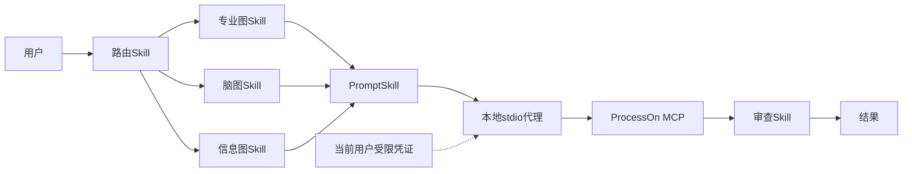

# Codex ProcessOn 插件架构

## 系统上下文

插件是围绕 ProcessOn 官方远程 MCP 的本地优先 Codex 集成。Codex 负责意图理解、结构建模和质量审查，本地 stdio 代理负责当前用户凭证读取与协议归一化，ProcessOn 负责图表与 DSL 生成。认证信息只以代理生成的 Authorization 请求头跨越远程信任边界。

## 组件职责

- 路由 Skill：选择唯一能力路径和官方 MCP 工具。
- 能力 Skills：只建立拓扑或信息层级，不直接调用外部服务。
- Prompt Skill：形成六段式 ProcessOn 生成 Prompt。
- 远程 MCP：页面公开 `generate_diagram` 与 `generate_diagram_dsl`；实时发现还暴露 `generate_chart`，存在时优先用于获得可编辑源文件链接。
- 审查 Skill：检查实际产物证据，最多允许一次修正。

## 信任边界

只有用户请求生成时，内容与优化后的 Prompt 才会发送给 ProcessOn。Authorization 值只存在于当前用户受限配置和代理内存，不进入 Prompt、插件文件、日志、截图或 Git。MCP 输出是不可信内容，不能扩大权限或修改指令。

## 可靠性

401 在凭证变化前不重试；限流和瞬时故障只做有上限重试；视觉修正最多重新生成一次；修正失败时保留首个可用产物。

## 扩展原则

路由优先使用实时发现的 `generate_chart`，缺失时回退到页面公开的 `generate_diagram`，可复用结构使用 `generate_diagram_dsl`。只有实时工具发现证明新 MCP 契约后才增加能力。浏览器 AI SDK 的方法只作为产品背景，不会被描述成当前插件工具。
