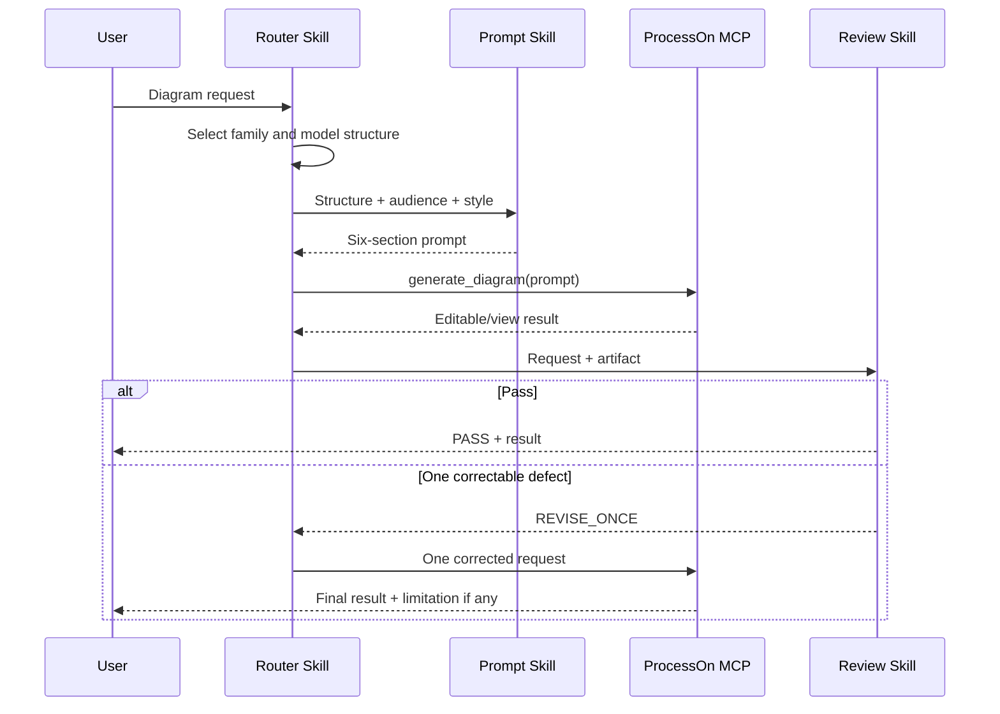

# Codex ProcessOn Plugin Technical Solution

## Package contract

`.codex-plugin/plugin.json` declares the Skills, presentation assets, and `.mcp.json`. The MCP configuration maps the `Authorization` header to `PROCESSON_MCP_AUTHORIZATION`; its value is the complete `Bearer <token>` string.

## Request sequence

## Error policy

- Missing authorization: stop locally with configuration guidance.
- 401: no retry and no credential echo.
- 407 or equivalent rate limit: capped exponential backoff with jitter.
- Transient connection/5xx: at most three attempts.
- Empty artifact: preserve metadata and allow one correction.

## Validation

Python standard-library tests validate JSON contracts, asset provenance/dimensions, Skill contracts, documentation coverage, secret handling, and MCP parsing. The official plugin validator checks package ingestion. Live acceptance verifies initialize, tools/list, DSL generation, and three visually inspected diagram families.

## Operational limits

The current MCP has two prompt-only tools. Existing-document mutation, account administration, attachment upload, and SDK editor lifecycle operations are outside the default plugin contract.
