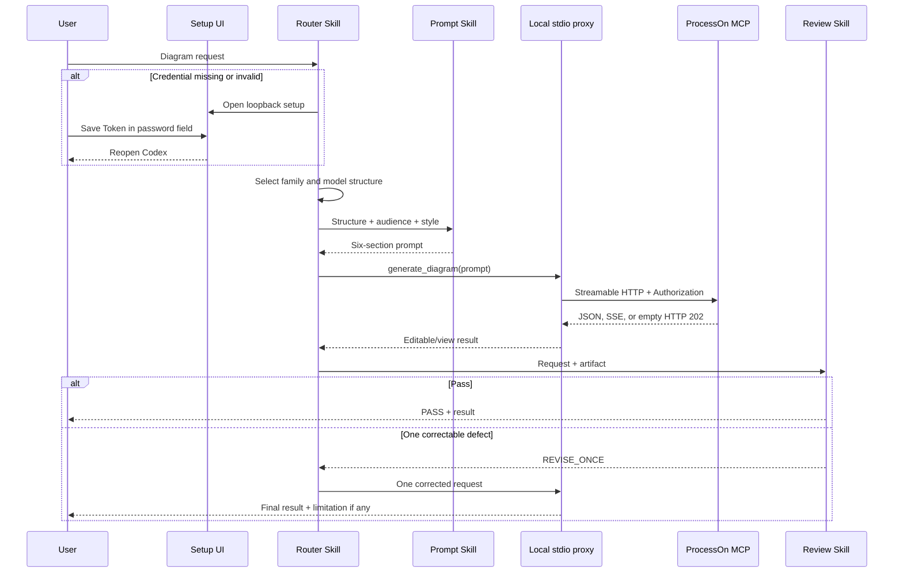

# Codex ProcessOn Plugin Technical Solution

> **Document control**
>
> | Field | Value |
> |---|---|
> | Status | Implemented; released as `0.1.0+codex.<cachebuster>` |
> | Scope | The package contract, request sequence, error policy, and the verification that backs them |
> | Audience | Implementers extending or reviewing this plugin |
> | Runtime evidence | `artifacts/acceptance/` |

## 1. Decision

Keep the credential out of the repository by moving transport into a local stdio proxy. The committed configuration starts that proxy; the proxy resolves the credential, adds exactly one `Bearer` prefix, and forwards to the official endpoint.

### Alternatives considered

| Alternative | Why it was rejected |
|---|---|
| Inline HTTP headers in committed configuration | Would put a live credential into Git, where it cannot be rotated safely |
| Environment variable as the normal path | Requires every user to edit a shell profile, and leaks into process listings |
| A hosted relay that holds the credential | Introduces a third party into the trust boundary for no functional gain |
| Storing the token in the plugin cache | The cache is versioned and replaced on upgrade, so the credential would be lost or duplicated |
| Replaying a generation after a timeout | The call is write-like, so a replay can duplicate an artifact or a charge |

## 2. Package contract

`.codex-plugin/plugin.json` declares the Skills, presentation assets, and `.mcp.json`. The committed MCP configuration contains only a local stdio command. The proxy obtains a raw Token from `PROCESSON_MCP_TOKEN` or restricted current-user storage, adds the `Bearer` scheme, and forwards to the official ProcessOn endpoint.

| File | Contract |
|---|---|
| `.codex-plugin/plugin.json` | Plugin identity, presentation metadata, Skill and MCP discovery |
| `.mcp.json` | A four-field stdio declaration: type, command, args, cwd. No URL, headers, or environment |
| `processon_harness/secrets.py` | Normalization, lookup priority, and restricted atomic storage |
| `scripts/processon_setup.py` | The only normal credential entry point, plus a status check |
| `scripts/validate_distribution.py` | Package structure, references, and secret scanning |

## 3. Request sequence

## 4. Transport mechanics

| Mechanism | Implementation |
|---|---|
| Framing | One JSON object per stdin line; one compact JSON response per line on stdout, flushed after each response |
| Protocol header | `MCP-Protocol-Version: 2025-06-18` on every upstream request |
| Session | `Mcp-Session-Id` is captured from the upstream response and replayed on subsequent requests |
| Redirects | Disabled through a custom redirect handler, so the credential never follows a redirect off the official origin |
| Notification handling | An empty HTTP 202 body produces no stdout line |
| Endpoint validation | Only the official HTTPS origin and loopback test fixtures are accepted |
| Diagnostics | Emitted only as sanitized JSON-RPC errors, never as free-form stdout |

## 5. Error policy

- Missing authorization: return `PROCESSON_SETUP_REQUIRED` and open local setup.
- 401: reload credentials once; a second failure returns `PROCESSON_AUTH_REQUIRED` without credential echo.
- Empty HTTP 202 notification: accept it and emit no JSON-RPC message.
- Generation timeout, connection failure, 408, or 5xx: return `UNKNOWN_WRITE_RESULT` without replay.
- 407/429: return a safe bounded failure without an automatic loop.
- Empty artifact: preserve metadata and allow one correction.

Every error carries a stable data code alongside the JSON-RPC error, so a caller can branch on the code rather than on the message text.

## 6. Timeouts

| Budget | Value | Reason |
|---|---|---|
| Read | 30 seconds | Read-only calls are fast, so a slow read indicates a transport problem |
| Generation | 180 seconds | Measured generations reached 27 and 33 seconds; a shared 30-second budget aborted valid work and surfaced as `UNKNOWN_WRITE_RESULT` |

The two budgets are separate because a generation is both slower and not safely replayable.

## 7. Test strategy

Python standard-library tests validate JSON contracts, asset provenance/dimensions, Skill contracts, documentation coverage, secret handling, and MCP parsing. The official plugin validator checks package ingestion. Live acceptance verifies initialize, tools/list, DSL generation, and three visually inspected diagram families.

| Layer | Proves | Command |
|---|---|---|
| Unit | Normalization, storage permissions, transport framing, error taxonomy | `python3 -m unittest discover -s tests -p 'test_*.py' -v` |
| Setup contract | Loopback binding, Origin and CSRF checks, body limits, non-disclosure | included in the suite |
| Distribution | Required files, manifest references, secret scan | `python3 scripts/validate_distribution.py` |
| Plugin ingestion | Compatibility with the official validator | `python3 <plugin-creator>/scripts/validate_plugin.py .` |
| Live | initialize, tools/list, and generation through the installed proxy | `artifacts/acceptance/` |

## 8. Operational limits and evidence map

The MCP page documents two prompt-only tools, while live discovery on 2026-09-13 returned a third prompt-only tool, `generate_chart`. The plugin prefers that live tool for editable links and retains the documented fallback. Existing-document mutation, account administration, attachment upload, and SDK editor lifecycle operations remain outside the default plugin contract.

| Claim | Evidence |
|---|---|
| Credential handling | `processon_harness/secrets.py` and its tests |
| Transport and error taxonomy | `processon_harness/mcp_proxy.py` and its tests |
| Installed entry point | `scripts/processon_mcp_proxy.py` |
| Setup page security | `scripts/processon_setup.py` and its tests |
| Live behavior | `artifacts/acceptance/` |
