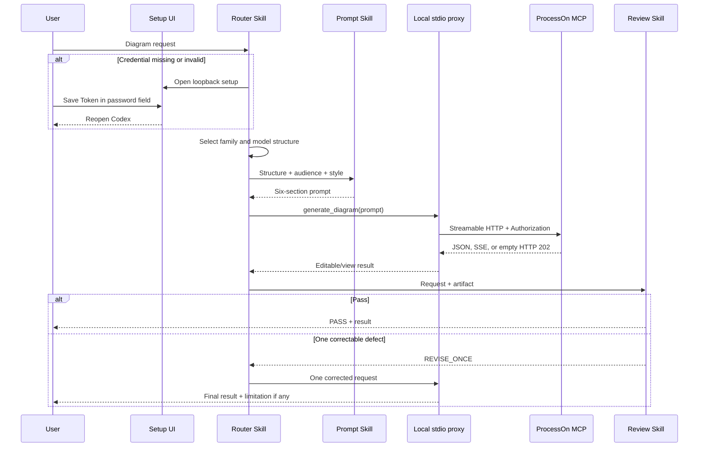

# Codex ProcessOn Plugin Technical Solution

## Package contract

`.codex-plugin/plugin.json` declares the Skills, presentation assets, and `.mcp.json`. The committed MCP configuration contains only a local stdio command. The proxy obtains a raw Token from `PROCESSON_MCP_TOKEN` or restricted current-user storage, adds the `Bearer` scheme, and forwards to the official ProcessOn endpoint.

## Request sequence

## Error policy

- Missing authorization: return `PROCESSON_SETUP_REQUIRED` and open local setup.
- 401: reload credentials once; a second failure returns `PROCESSON_AUTH_REQUIRED` without credential echo.
- Empty HTTP 202 notification: accept it and emit no JSON-RPC message.
- Generation timeout, connection failure, 408, or 5xx: return `UNKNOWN_WRITE_RESULT` without replay.
- 407/429: return a safe bounded failure without an automatic loop.
- Empty artifact: preserve metadata and allow one correction.

## Validation

Python standard-library tests validate JSON contracts, asset provenance/dimensions, Skill contracts, documentation coverage, secret handling, and MCP parsing. The official plugin validator checks package ingestion. Live acceptance verifies initialize, tools/list, DSL generation, and three visually inspected diagram families.

## Operational limits

The MCP page documents two prompt-only tools, while live discovery on 2026-09-13 returned a third prompt-only tool, `generate_chart`. The plugin prefers that live tool for editable links and retains the documented fallback. Existing-document mutation, account administration, attachment upload, and SDK editor lifecycle operations remain outside the default plugin contract.
