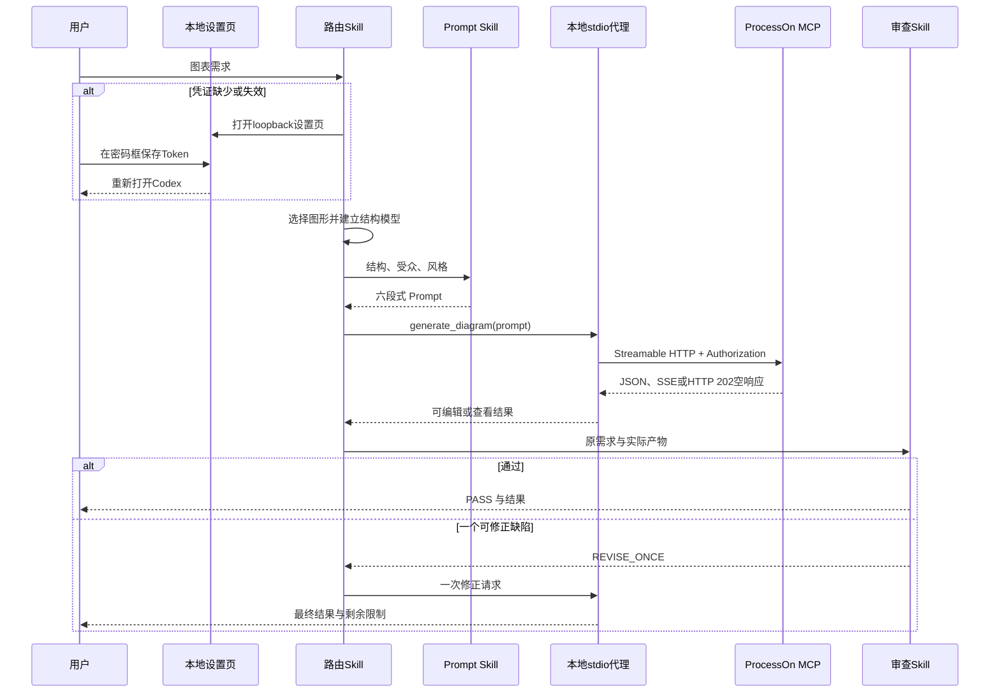

# Codex ProcessOn 插件技术方案

## 包契约

`.codex-plugin/plugin.json` 声明 Skills、展示资产与 `.mcp.json`。已提交的 MCP 配置只包含本地 stdio 命令。代理从 `PROCESSON_MCP_TOKEN` 或当前用户受限配置读取原始 Token，添加 `Bearer` 前缀后转发到 ProcessOn 官方端点。

## 请求时序

## 错误策略

- 缺少授权：返回 `PROCESSON_SETUP_REQUIRED` 并打开本地设置。
- 401：重新读取凭证一次；第二次失败返回 `PROCESSON_AUTH_REQUIRED`，不回显凭证。
- HTTP 202 空通知响应：视为成功，不输出 JSON-RPC 消息。
- 生成超时、连接失败、408 或 5xx：返回 `UNKNOWN_WRITE_RESULT`，不重放。
- 407/429：返回安全的有界失败，不启动自动循环。
- 空产物：保留非敏感元数据，最多修正一次。

## 验证体系

Python 标准库测试覆盖 JSON 契约、Logo 来源与尺寸、Skill 契约、文档完整性、敏感信息和 MCP 解析。官方插件校验器验证包可被 Codex 接收。在线验收验证初始化、工具发现、DSL 生成，并对三类真实图表做视觉检查。

## 运行边界

MCP 页面公开两个 `prompt` 入参工具，2026-09-13 实时发现新增第三个 `prompt` 工具 `generate_chart`。插件优先使用它获得可编辑链接，同时保留页面公开工具作为兼容回退。已有文档修改、账户管理、附件上传以及 AI SDK 编辑器生命周期方法仍不属于默认插件契约。
