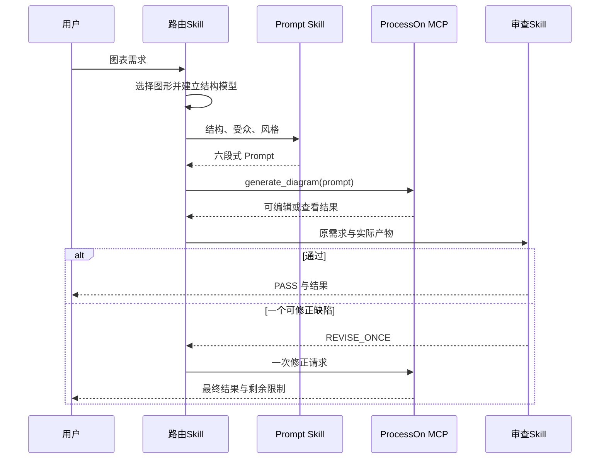

# Codex ProcessOn 插件技术方案

## 包契约

`.codex-plugin/plugin.json` 声明 Skills、展示资产与 `.mcp.json`。MCP 配置通过 `env_http_headers` 把 `Authorization` 映射到 `PROCESSON_MCP_AUTHORIZATION`，环境变量值是完整的 `Bearer <token>`。

## 请求时序

## 错误策略

- 缺少授权：本地停止并给出配置方式。
- 401：不重试、不回显凭证。
- 407 或等价限流：有上限的指数退避与抖动。
- 瞬时连接故障或 5xx：最多三次尝试。
- 空产物：保留非敏感元数据，最多修正一次。

## 验证体系

Python 标准库测试覆盖 JSON 契约、Logo 来源与尺寸、Skill 契约、文档完整性、敏感信息和 MCP 解析。官方插件校验器验证包可被 Codex 接收。在线验收验证初始化、工具发现、DSL 生成，并对三类真实图表做视觉检查。

## 运行边界

当前 MCP 只有两个 `prompt` 入参工具。已有文档修改、账户管理、附件上传以及 AI SDK 编辑器生命周期方法不属于默认插件契约。
