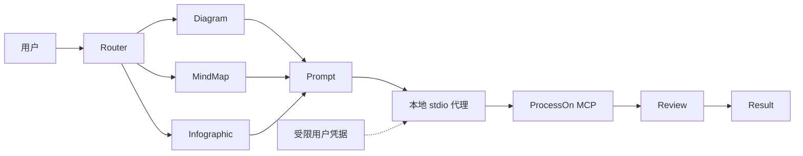
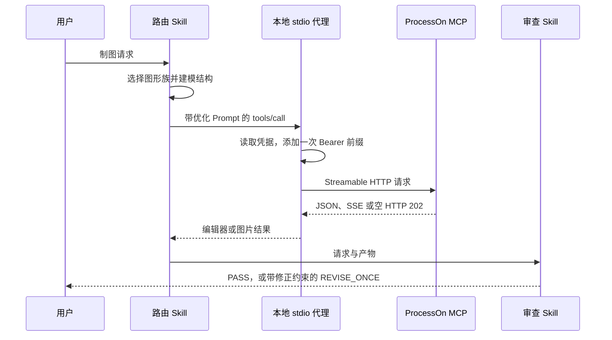

# ProcessOn Design 插件架构

> **文档信息**
>
> | 字段 | 值 |
> |---|---|
> | 状态 | 已实现；以 `0.1.0+codex.<cachebuster>` 发布 |
> | 范围 | 本插件如何把一次制图请求变成经审查的 ProcessOn 产物，且不暴露凭据 |
> | 读者 | 插件维护者、安全审阅者与集成者 |
> | 不在范围 | ProcessOn 服务本身、其生成质量与账号模型 |
> | 运行证据 | `artifacts/` 与真机验收记录 |
> | 最近一次结构修订 | 2026-09-14 |

## 1. 执行摘要

本插件是围绕 ProcessOn 官方远程 MCP 的本地优先 Codex 集成。Codex 负责意图理解与审查；本地 stdio 代理负责当前用户凭据查找与协议规范化；ProcessOn 负责图表与 DSL 生成。认证只以"代理生成的 Authorization 头"这一种形式跨过远程信任边界。

三条性质定义了这套架构：

- 已提交配置中没有任何凭据，也没有远程请求头；
- 代理只添加一次 `Bearer` 前缀，并且只转发到官方端点；
- 结果含糊时，生成请求绝不自动重放。

## 2. 驱动力与约束

| 驱动力 | 对架构的后果 |
|---|---|
| 凭据绝不进入 Git、日志或 Prompt | Token 存放在受限的当前用户存储中，且只由代理读取 |
| MCP 契约有文档但不完整 | 工具选择以实时发现为准，文档所列工具作为回退 |
| 生成较慢，偶尔慢到会突破天真的超时设定 | 写类调用使用与只读调用分开的生成预算 |
| 生成属于写类操作，不可重放 | 每个 `tools/call` 都按写类处理，含糊结果返回明确的核对码 |
| 用户不该去改 JSON 或 shell 配置 | 回环设置页是唯一正常的凭据录入路径 |

### 非目标

- 管理 ProcessOn 账号、套餐或分享权限。
- 静默上传本地文件。
- 修改未指定的已有文档。
- 把实时 MCP 未暴露的浏览器 SDK 方法描述成可用工具。

## 3. 上下文与信任边界



| 边界 | 内部 | 外部 |
|---|---|---|
| 本仓库 | Skills、stdio 代理、设置程序、校验器 | 内容生成 |
| 凭据文件 | 只由代理读取 | 绝不发送到其他来源 |
| ProcessOn | 生成、产物托管、账号状态 | 只通过官方端点触达 |

只有在请求生成时，用户内容与优化后的 Prompt 才会发送给 ProcessOn。授权值留在受限的当前用户存储与代理内存中，不出现在 Prompt、插件文件、日志、截图与 Git 里。MCP 输出属于不可信内容，不能授予权限，也不能改变指令。

## 4. 当前状态、目标状态与差距

| 能力 | 当前 | 目标 | 差距 |
|---|---|---|---|
| 凭据设置 | 三步回环页面，另有隐藏终端兜底 | 不变 | 无 |
| 凭据存储 | 当前用户文件，目录 `0700`、文件 `0600`，原子写 | 不变 | 无 |
| 协议规范化 | 已在 stdio 代理中实现 | 不变 | 无 |
| 工具选择 | 实时发现 + 文档回退 | 不变 | 文档工具与实时工具有差异，做法是记录而不是隐藏 |
| 写路径安全 | 不自动重放；返回明确的核对码 | 不变 | 无 |
| 成功但内容为空 | 原样透传 | 需要一次产品决策 | 上游间歇行为，已记录但尚未映射为错误 |
| 运行台账 | 无；每次生成都是无状态的 | 按设计不变 | 不算差距：工具契约本身没有可恢复任务 |

## 5. 原则与决策

| 决策 | 理由 | 反转条件 |
|---|---|---|
| 本地持有凭据，而不是接受内联请求头 | 内联请求头会把秘密写进已提交配置 | 无 |
| 优先使用实时发现的工具，而非文档工具 | 实时的服务端才是"什么真正可用"的事实源 | 若实时面回退到文档集合 |
| 把每个 `tools/call` 都当写类 | 工具集合是开放的，没有任何调用可以假定可安全重放 | 若服务端公布逐工具幂等性 |
| 只读与生成使用不同的超时 | 单一 30 秒预算会掐断合法生成 | 仅当服务端承诺有界响应时间 |
| 重试有界且显式 | 静默重试会掩盖上游问题，并可能重复写入 | 无 |

## 6. 组件与依赖

| 组件 | 负责 | 不负责 |
|---|---|---|
| 路由 Skill | 选择一条能力路径与一个官方 MCP 工具 | 生成 |
| 能力 Skill | 在不调用外部服务的前提下构建拓扑或信息层级 | 远程调用 |
| Prompt 架构 | 产出六段式、可直接交给 ProcessOn 的 Prompt | 产物审查 |
| `scripts/processon_mcp_proxy.py` | 已安装的 stdio 入口点 | 凭据策略 |
| `processon_harness/mcp_proxy.py` | 帧、传输、会话与错误分类 | 凭据存储 |
| `processon_harness/secrets.py` | 规范化、查找优先级、受限原子存储 | 传输 |
| `scripts/processon_setup.py` | 回环页面、隐藏设置与状态检查 | 图表生成 |
| 审查 Skill | 检查真实产物证据，最多允许一次修正 | 重绘循环 |

依赖方向是单向的：Skills 经 stdio 调用代理；代理读取凭据提供器并访问官方端点。没有组件反向进入 Codex，除代理之外也没有组件发起网络 I/O。

## 7. 运行期与核心流程

### 7.1 主流程



### 7.2 失败与恢复语义

| 失败 | 检测方式 | 行为 | 恢复 |
|---|---|---|---|
| 凭据缺失 | 提供器查找 | 返回 `PROCESSON_SETUP_REQUIRED`；不发网络请求 | 完成本地设置页 |
| 凭据无效 | HTTP 401 或业务层鉴权消息 | 只重载一次，随后返回 `PROCESSON_AUTH_REQUIRED` | 在设置页轮换 Token |
| 通知类响应 | 状态 202 且响应体为空 | 静默接受；不输出任何 JSON-RPC 消息 | 无 |
| 生成超时或传输失败 | 写类发送失败 | 返回 `UNKNOWN_WRITE_RESULT`；不重放 | 先在 ProcessOn 中核对待处理结果再重试 |
| 限流或上游瞬时错误 | HTTP 407/429 或 5xx | 返回安全且有界的上游错误 | 等待后有意重试 |
| stdio 输入畸形 | 帧校验 | 返回 `INVALID_JSON_RPC`，不回显请求体 | 修正调用方 |
| 成功但产物为空 | 结果检查 | 原样保留；记为已知上游行为 | 如实报告，由用户决定 |

在凭据改变之前，401 都是终态。限流与瞬时失败使用有界重试。视觉修正最多一次重绘。修正失败时，保留第一个可用产物。

## 8. 状态、数据与协议

| 数据 | 所有者 | 位置 | 一致性 |
|---|---|---|---|
| 凭据 | 本仓库 | `~/.config/processon/credentials.json`，目录 `0700`、文件 `0600` | fsync 后原子替换 |
| 上游会话 ID | 代理 | 代理进程内存中 | 进程生命周期 |
| 生成的图表 | ProcessOn | 由服务方持有 | 经官方端点触达 |
| 运行状态 | 无 | 代理对每个请求都是无状态的 | 不适用 |

协议为 MCP `2025-06-18`，经 Streamable HTTP 访问 `https://smart-hd.processon.com/mcp`，并遵循文档声明的每 Token 每分钟 600 次上限。

## 9. 安全

- 已提交的 `.mcp.json` 只包含一条本地 stdio 命令：没有 URL、没有请求头、没有环境凭据。
- 代理只添加一次 `Bearer` 前缀，且只转发到官方端点。
- 设置页只绑定 `127.0.0.1`，校验 Origin 与 CSRF，限制请求体上限，且绝不回显提交的值。
- 凭据目录为 `0700`、文件为 `0600`；写入是同目录、flush、fsync 后原子替换。
- 符号链接的凭据目录与非用户属主的目录会被拒绝。
- 错误经过脱敏：不暴露上游原文，也不暴露凭据内容。

## 10. 资源与运行预算

| 预算 | 值 | 理由 |
|---|---|---|
| 只读超时 | 30 秒 | 只读调用很快；慢读通常意味着传输问题 |
| 生成超时 | 180 秒 | 实测生成达到 27 秒与 33 秒，30 秒上限会掐断合法工作 |
| 认证刷新 | 恰好一次 | 第二次失败必须暴露出来，而不是循环 |
| 视觉修正 | 最多一次重绘 | 防止无界重绘 |
| 上游契约 | 开放工具集合 | 迫使把每个 `tools/call` 都当作写类 |

### 运行

```bash
python3 -m unittest discover -s tests -p 'test_*.py' -v
python3 scripts/validate_distribution.py
python3 scripts/processon_setup.py check
```

`check` 只报告可用性，绝不报告凭据或其路径内容。

## 11. 部署、兼容性与演进

| 方面 | 立场 |
|---|---|
| 分发 | 指向本仓库的 Codex marketplace 条目 |
| 宿主 | Codex CLI，实测于 `0.154.0-alpha.6.2` |
| 协议 | `2025-06-18`，Streamable HTTP |
| 回滚 | 恢复此前的远程 HTTP 配置并重装；凭据文件属于用户数据，不会被自动删除 |

### 可扩展性

路由优先使用实时发现的 `generate_chart`，回退到文档所列的 `generate_diagram`，并在需要可复用结构时使用 `generate_diagram_dsl`。新增 ProcessOn 能力必须先由实时工具发现证明其 MCP 契约受支持。浏览器 SDK 方法只是文档背景，不构成插件工具。

| 风险 | 缓解 |
|---|---|
| 文档工具与实时工具集合分歧 | 运行时做发现，并记录差异 |
| 上游返回空的成功结果 | 记为已知行为，并给出拟定的错误映射 |
| 凭据泄露 | 受限存储、脱敏错误，以及分发校验器中的秘密扫描 |

## 12. 证据映射

| 断言 | 证据 |
|---|---|
| 凭据处理与优先级 | `processon_harness/secrets.py` 及其测试 |
| 传输、超时与错误分类 | `processon_harness/mcp_proxy.py` 及其测试 |
| 设置页加固 | `scripts/processon_setup.py` 及其测试 |
| 包与秘密安全 | `scripts/validate_distribution.py` |
| 实时协议与生成验收 | `artifacts/acceptance/` |
