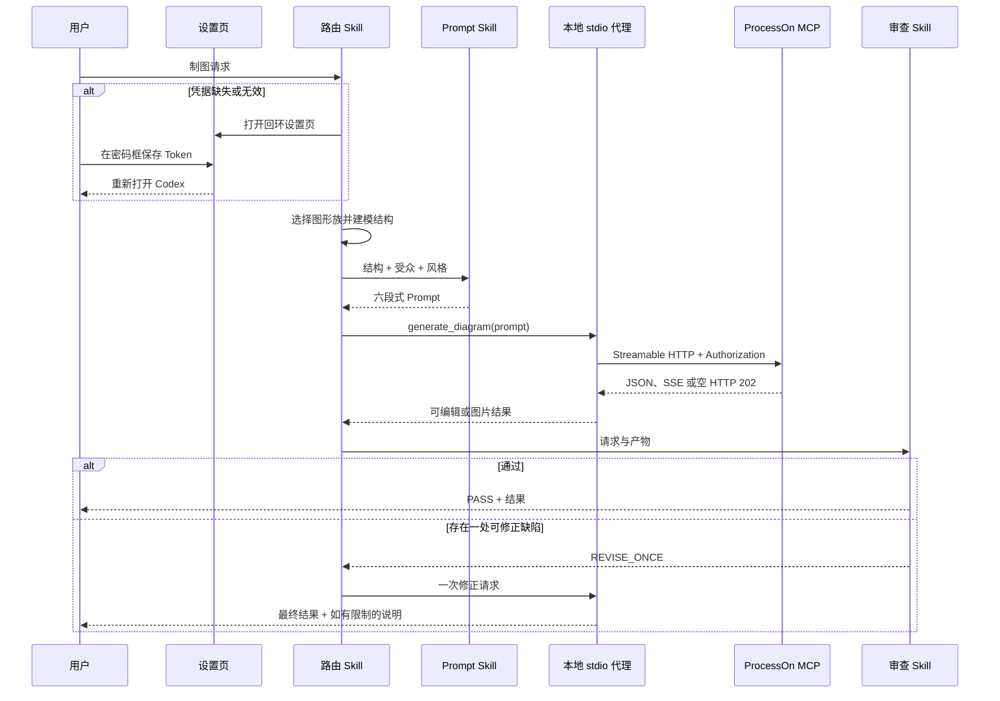

# ProcessOn Design 插件技术方案

> **文档信息**
>
> | 字段 | 值 |
> |---|---|
> | 状态 | 已实现；以 `0.1.0+codex.<cachebuster>` 发布 |
> | 范围 | 包契约、请求时序、错误策略，以及支撑它们的验证 |
> | 读者 | 扩展或评审本插件的实现者 |
> | 运行证据 | `artifacts/acceptance/` |

## 1. 技术决策

把传输搬进本地 stdio 代理，从而让凭据不进仓库。已提交配置只负责启动该代理；代理解析凭据、只添加一次 `Bearer` 前缀，并转发到官方端点。

### 备选方案

| 备选方案 | 被否的原因 |
|---|---|
| 在已提交配置里内联 HTTP 请求头 | 会把有效凭据写进 Git，且无法安全轮换 |
| 把环境变量作为常规路径 | 要求每个用户去改 shell 配置，并且会出现在进程列表里 |
| 用托管中转服务持有凭据 | 无功能收益地把第三方拉进信任边界 |
| 把 Token 存进插件缓存 | 缓存是版本化的且在升级时被替换，凭据会丢失或被复制 |
| 超时后重放生成请求 | 该调用属于写类，重放可能重复产物或重复产生费用 |

## 2. 包契约

`.codex-plugin/plugin.json` 声明 Skills、展示资产与 `.mcp.json`。已提交的 MCP 配置只包含一条本地 stdio 命令。代理从 `PROCESSON_MCP_TOKEN` 或受限的当前用户存储取得原始 Token，补上 `Bearer` 方案，并转发到 ProcessOn 官方端点。

| 文件 | 契约 |
|---|---|
| `.codex-plugin/plugin.json` | 插件身份、展示元数据、Skill 与 MCP 发现 |
| `.mcp.json` | 四字段 stdio 声明：type、command、args、cwd。没有 URL、请求头或环境变量 |
| `processon_harness/secrets.py` | 规范化、查找优先级与受限原子存储 |
| `scripts/processon_setup.py` | 唯一正常的凭据录入路径，另含状态检查 |
| `scripts/validate_distribution.py` | 包结构、引用与秘密扫描 |

## 3. 请求时序

## 4. 传输机制

| 机制 | 实现 |
|---|---|
| 帧 | 每行 stdin 一个 JSON 对象；stdout 每行一条紧凑 JSON 响应，且每条响应后 flush |
| 协议头 | 每个上游请求都带 `MCP-Protocol-Version: 2025-06-18` |
| 会话 | 从上游响应捕获 `Mcp-Session-Id`，并在后续请求中回传 |
| 重定向 | 通过自定义重定向处理器禁用，使凭据不会跟随重定向离开官方来源 |
| 通知处理 | 空的 HTTP 202 响应体不产生任何 stdout 行 |
| 端点校验 | 只接受官方 HTTPS 来源与回环测试夹具 |
| 诊断 | 只以脱敏的 JSON-RPC 错误输出，绝不写自由格式 stdout |

## 5. 错误策略

- 缺少授权：返回 `PROCESSON_SETUP_REQUIRED` 并打开本地设置。
- 401：只重载一次凭据；第二次失败返回 `PROCESSON_AUTH_REQUIRED`，且不回显凭据。
- 空的 HTTP 202 通知：接受，且不输出任何 JSON-RPC 消息。
- 生成超时、连接失败、408 或 5xx：返回 `UNKNOWN_WRITE_RESULT`，不重放。
- 407/429：返回安全且有界的失败，不进入自动循环。
- 产物为空：保留元数据，并允许一次修正。

每个错误都带一个稳定的数据码与 JSON-RPC 错误并列，调用方可以基于错误码分支，而不必解析消息文本。

## 6. 超时

| 预算 | 值 | 理由 |
|---|---|---|
| 只读 | 30 秒 | 只读调用很快，慢读通常意味着传输问题 |
| 生成 | 180 秒 | 实测生成达到 27 秒与 33 秒；共用的 30 秒预算会掐断合法工作，并以 `UNKNOWN_WRITE_RESULT` 呈现 |

两套预算之所以分开，是因为生成既更慢，又不可安全重放。

## 7. 测试策略

Python 标准库测试校验 JSON 契约、资产来源与尺寸、Skill 契约、文档覆盖、秘密处理与 MCP 解析。官方插件校验器检查包摄取。真机验收覆盖 initialize、tools/list、DSL 生成，以及三个经目视检查的图形族。

| 层次 | 证明 | 命令 |
|---|---|---|
| 单元 | 规范化、存储权限、传输帧、错误分类 | `python3 -m unittest discover -s tests -p 'test_*.py' -v` |
| 设置契约 | 回环绑定、Origin 与 CSRF 校验、请求体上限、不回显 | 包含在上述套件中 |
| 分发 | 必需文件、清单引用、秘密扫描 | `python3 scripts/validate_distribution.py` |
| 插件摄取 | 与官方校验器的兼容性 | `python3 <plugin-creator>/scripts/validate_plugin.py .` |
| 真机 | 经已安装代理的 initialize、tools/list 与生成 | `artifacts/acceptance/` |

## 8. 运行限制与证据映射

MCP 页面记录了两个 prompt-only 工具，而 2026-09-13 的实时发现返回了第三个 prompt-only 工具 `generate_chart`。插件优先使用该实时工具以获得可编辑链接，同时保留文档所列的回退工具。已有文档修改、账号管理、附件上传与 SDK 编辑器生命周期操作仍不在默认插件契约内。

| 断言 | 证据 |
|---|---|
| 凭据处理 | `processon_harness/secrets.py` 及其测试 |
| 传输与错误分类 | `processon_harness/mcp_proxy.py` 及其测试 |
| 已安装入口点 | `scripts/processon_mcp_proxy.py` |
| 设置页安全 | `scripts/processon_setup.py` 及其测试 |
| 真机行为 | `artifacts/acceptance/` |
