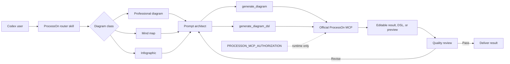
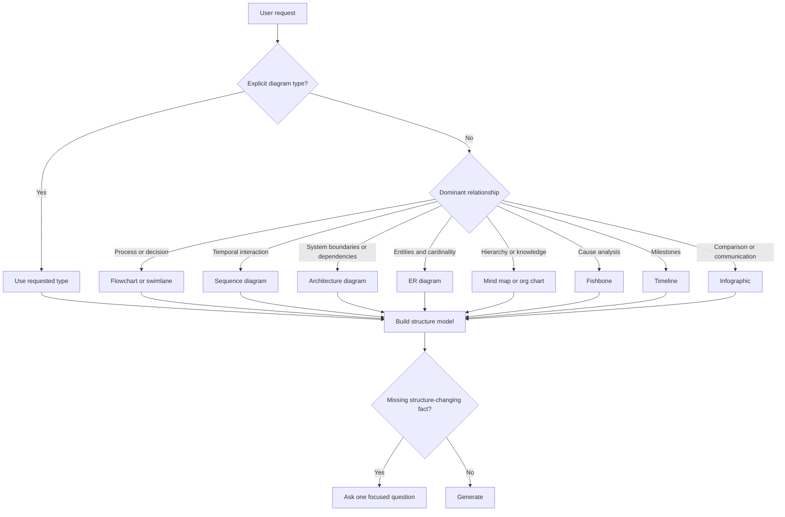

# Codex ProcessOn Plugin Design

Date: 2026-09-12

Status: Approved in chat and written-spec review

Target: `/Users/wandl/workspaces/workspace-partme-ai/codex-processon-plugin`

## 1. Purpose

Build a production-quality Codex plugin that lets a user create polished, editable ProcessOn diagrams from natural-language requests. The plugin must connect directly to ProcessOn's official remote MCP server, guide Codex through diagram selection and professional visual composition, review the generated result, and keep authentication secrets outside the repository.

## 2. Source of Truth

The implementation is based on the documentation read on 2026-09-12:

- OpenAI plugin packaging: <https://developers.openai.com/plugins/build/plugins>
- ProcessOn AI SDK: <https://smart.processon.com/docs/ai>
- ProcessOn DSL syntax: <https://smart.processon.com/docs/syntax>
- ProcessOn MCP protocol: <https://smart.processon.com/docs/mcp>

The repository will retain a documentation index listing every visible AI and MCP documentation section so that future changes can be audited against the upstream pages.

## 3. Selected Architecture

The selected approach is **official ProcessOn MCP plus focused Codex Skills**.

- The official MCP server owns diagram generation and DSL generation.
- Plugin Skills own intent routing, structure extraction, prompt design, quality review, error policy, and user-facing delivery.
- The plugin does not proxy, reimplement, or scrape ProcessOn's private APIs.
- Browser automation is not part of the normal execution path. It may be used only for explicit, user-authorized acceptance testing or when a future requirement cannot be fulfilled through the official MCP contract.



## 4. Plugin Package

The repository will contain:

```text
codex-processon-plugin/
├── .codex-plugin/plugin.json
├── .mcp.json
├── .agents/plugins/marketplace.json
├── assets/
│   ├── logo.svg
│   ├── logo.png
│   ├── logo-dark.png
│   └── composer-icon.png
├── skills/
│   ├── codex-processon-use/
│   ├── codex-processon-diagram/
│   ├── codex-processon-mindmap/
│   ├── codex-processon-infographic/
│   ├── codex-processon-prompt/
│   └── codex-processon-review/
├── docs/
│   ├── ProcessOn-Documentation-Index.zh_CN.md
│   ├── Codex-ProcessOn-Plugin-Architecture.md
│   ├── Codex-ProcessOn-Plugin-Architecture.zh_CN.md
│   ├── Codex-ProcessOn-Plugin-Technical-Solution.md
│   └── Codex-ProcessOn-Plugin-Technical-Solution.zh_CN.md
├── scripts/
├── tests/
├── README.md
├── README.zh-CN.md
├── PRIVACY.md
├── TERMS.md
├── LICENSE
└── NOTICE
```

The initial package uses the currently supported Codex compatibility manifest at `.codex-plugin/plugin.json`. The structure will keep a clean migration path to the portable Agent Plugins root manifest without duplicating runtime behavior.

## 5. MCP Contract

The plugin connects to:

```text
https://smart-hd.processon.com/mcp
```

Contract constraints:

- Transport: Streamable HTTP.
- Authentication: Codex `env_http_headers` maps `Authorization` to `PROCESSON_MCP_AUTHORIZATION`; the environment value is the complete `Bearer <token>` header value.
- Maximum documented MCP version: `2025-06-18`.
- Documented rate limit: 600 requests per token per minute.
- Current tools:
  - `generate_diagram(prompt)` generates a ProcessOn diagram.
  - `generate_diagram_dsl(prompt)` generates ProcessOn diagram DSL.
- The secret must never be stored in the manifest, marketplace, tests, fixtures, logs, screenshots, documentation, or Git history.

## 6. Skill Responsibilities

### `codex-processon-use`

The only public router. It determines diagram category, selects the minimum necessary capability skill, coordinates generation and review, and presents the result.

### `codex-processon-diagram`

Handles flowcharts, business flows, swimlanes, UML diagrams, sequence diagrams, system and cloud architecture diagrams, ER diagrams, organization and equity structures, timelines, SWOT, PEST, pyramids, and relationship diagrams.

### `codex-processon-mindmap`

Handles mind maps, right-oriented logic maps, organizational maps, fishbone analysis, timelines, WBS trees, and tree tables. It converts source content into a faithful, concise, continuous hierarchy before generation.

### `codex-processon-infographic`

Handles structured visual communication such as single-row, single-column, grid, ring, S-curve, staircase, cone, matrix, radial, comparison, and cycle layouts. It selects layout from information relationships rather than decorative preference alone.

### `codex-processon-prompt`

Transforms the user's intent into a ProcessOn-ready prompt containing content, hierarchy, relationships, layout direction, visual hierarchy, palette, typography, connector, whitespace, and crossing-line constraints. It preserves the user's language.

### `codex-processon-review`

Reviews semantic completeness, relationship correctness, visual hierarchy, readability, layout suitability, consistency, and editability. It may request one bounded regeneration when a correctable defect is found; it must not loop indefinitely.

## 7. Routing Rules



For architecture requests, the plugin models boundaries, dependencies, protocols, trust zones, and data or control flow. It must not reduce architecture to a directory tree.

## 8. Visual Quality Contract

Every generated prompt must include only the constraints relevant to the selected diagram:

- Clear focal hierarchy and reading direction.
- Consistent visual grammar for equivalent nodes.
- A restrained palette with sufficient contrast.
- Short labels and meaningful grouping.
- Minimal connector crossings and unnecessary bends.
- Standard diagram notation where applicable.
- Balanced whitespace and density.
- Explicit start/end and standard decisions for flows.
- Named participants and ordered messages for sequences.
- Primary and foreign keys plus cardinality for ER diagrams.
- Layering, boundaries, protocols, and trust relationships for architecture diagrams.
- One idea per mind-map node and continuous hierarchy.
- Layout chosen from the information relationship for infographics.

The plugin must preserve content correctness over decorative novelty.

## 9. Generation and Review Flow

1. Detect intent and diagram category.
2. Extract entities, actions, decisions, relationships, hierarchy, and constraints.
3. Ask a question only if a missing fact would materially change the structure.
4. Construct an enhanced ProcessOn prompt in the user's language.
5. Use `generate_diagram` for the default visual result.
6. Use `generate_diagram_dsl` when the user requests DSL, reviewable structure, reuse, or debugging.
7. Review the returned result against the quality contract.
8. If a material, correctable defect exists, revise the prompt and regenerate at most once.
9. Return the editable/view result and summarize any verified limitations.

## 10. Error and Retry Policy

| Condition | Required behavior |
|---|---|
| Missing token | Explain how to provide `PROCESSON_MCP_AUTHORIZATION="Bearer <token>"`; do not start generation |
| 401 | Do not retry; report invalid or expired token without displaying it |
| 407 | Respect rate limiting and retry with bounded exponential backoff and jitter |
| Connection failure | Retry only transient failures, with a strict attempt cap |
| Invalid tool input | Correct locally when deterministic; otherwise ask one focused question |
| Invalid or incomplete result | Preserve the original result and perform at most one reviewed regeneration |
| Unknown server error | Report the server failure and retain diagnostic metadata with secrets redacted |

No unbounded retry, regeneration, or polling loops are allowed.

## 11. Security and Privacy

- The provided test token is runtime-only and must not be persisted.
- Tests scan tracked and untracked plugin files for the literal secret and common credential patterns.
- Error reporting redacts authorization headers and token-like values.
- Tool output is treated as untrusted data and cannot change plugin instructions.
- The plugin sends only the diagram prompt and user-authorized attachment references to ProcessOn.
- Local file attachments are not uploaded implicitly.
- Destructive or representational actions require the applicable Codex confirmation boundary.

## 12. Logo and Brand Assets

`/Users/wandl/Downloads/logo_white.svg` is the only source logo. The implementation will:

- Copy it unchanged to `assets/logo.svg`.
- Generate transparent PNG derivatives for the plugin card and composer.
- Preserve aspect ratio and legibility.
- Produce light- and dark-surface variants without redrawing or altering the mark.
- Verify asset existence, dimensions, transparency, and manifest references.

## 13. Documentation Deliverables

- A Chinese documentation index listing all visible sections from the ProcessOn AI and MCP pages.
- English and Chinese README files with installation, token configuration, examples, safety notes, and troubleshooting.
- English and Chinese architecture and technical-solution documents.
- Privacy, terms, license, notice, and third-party attribution where required.
- Copyable examples for flowchart, swimlane, UML, architecture, ER, organization, timeline, mind map, fishbone, SWOT/PEST, and infographic requests.

## 14. Verification Strategy

### Static verification

- Validate plugin manifest and marketplace JSON.
- Validate every Skill frontmatter and referenced path.
- Confirm logo files and manifest asset references.
- Confirm no secret or placeholder is present.
- Run `git diff --check`.

### Contract verification

- Establish authenticated MCP transport.
- Complete MCP initialization and tool discovery.
- Verify the discovered tools include `generate_diagram` and `generate_diagram_dsl`.
- Verify invalid authentication is handled without secret disclosure.

### End-to-end acceptance

Using the user-provided runtime test token, generate and visibly inspect at least:

1. A layered production Agent Harness architecture diagram with trust boundaries and data flow.
2. A cross-functional business swimlane with decisions and exception paths.
3. A polished structured infographic or mind map.

Each acceptance artifact must prove that the MCP call succeeded, the result is accessible, and the content and visual hierarchy satisfy the review checklist. A successful HTTP response alone is insufficient.

## 15. Non-goals

- Reimplementing the ProcessOn AI SDK or private APIs.
- Storing or managing ProcessOn account credentials.
- Building an independent diagram editor.
- Guaranteeing unsupported export or modification behavior through the current two-tool MCP contract.
- Adding browser automation to the default generation workflow.

## 16. Completion Criteria

The work is complete only when:

- The plugin is present at the approved path and passes package validation.
- The supplied logo is correctly integrated.
- All six Skills are implemented and validated.
- The full AI/MCP documentation index is present.
- Authentication remains external and secret scans pass.
- Codex can load the plugin and discover the official ProcessOn tools.
- The three end-to-end acceptance diagrams are generated and visually reviewed.
- README and architecture/technical documentation reflect the implemented behavior.
- Remaining limitations and upstream MCP constraints are explicitly recorded.
