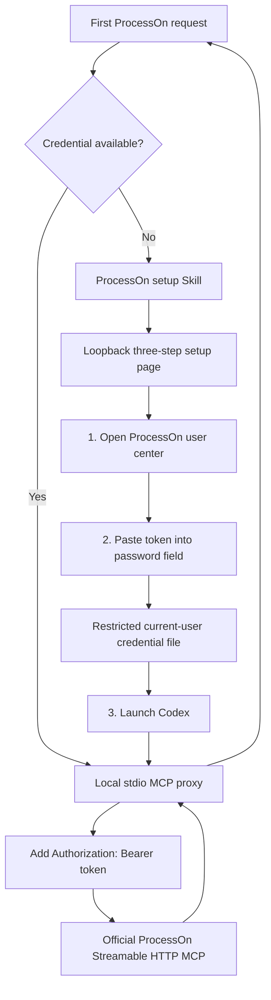

# ProcessOn Local Credential Setup Design

Date: 2026-09-14

Status: Approved in chat and confirmed as the implementation specification

Target: `codex-processon-plugin`

## 1. Purpose

Replace the developer-oriented requirement to export a ProcessOn authorization environment variable with a first-use local setup experience. A normal user installs the plugin, opens a three-step local page, pastes a ProcessOn token into a password field, saves it, and starts Codex. The token must remain outside the plugin package, repository, shell profiles, Codex configuration, logs, and chat history.

## 2. Selected Architecture

The design adapts the proven local credential pattern in `codex-stitch-design-plugin` to ProcessOn:



The committed `.mcp.json` contains no secret. It starts a local stdio proxy from the installed plugin root. The proxy owns credential lookup and HTTP header injection, then forwards JSON-RPC between Codex and the official ProcessOn endpoint.

## 3. User Experience

### First use

1. The user requests a ProcessOn diagram.
2. If no credential is available, the plugin reports that one-time setup is required and opens the local setup page.
3. The page presents one card with three steps:
   - Open <https://smart.processon.com/user> and create or copy a personal access token.
   - Paste the token into a password input and save it locally.
   - Open Codex and retry the original request.
4. The input is cleared after every save response.
5. The page never renders the stored token or sends it to any origin other than the loopback setup server.

### Later use

The stdio proxy reads the saved credential automatically. Plugin upgrades retain the user-level credential because it is stored outside versioned plugin caches.

### Advanced use

`PROCESSON_MCP_TOKEN` remains an optional process-level override for automation and ephemeral sessions. Users provide the raw ProcessOn token; the proxy adds the `Bearer ` prefix. The old `PROCESSON_MCP_AUTHORIZATION` variable is deprecated and is not part of the normal setup flow.

## 4. Package Changes

```text
codex-processon-plugin/
├── .mcp.json
├── processon_harness/
│   ├── __init__.py
│   ├── secrets.py
│   └── mcp_proxy.py
├── scripts/
│   ├── processon_mcp_proxy.py
│   └── processon_setup.py
├── assets/setup/
│   ├── index.html
│   ├── styles.css
│   └── app.js
├── skills/codex-processon-setup/
│   ├── SKILL.md
│   └── references/
├── tests/
│   ├── test_processon_secrets.py
│   ├── test_processon_setup.py
│   └── test_processon_mcp_proxy.py
├── README.md
├── README.zh-CN.md
└── PRIVACY.md
```

No JavaScript package manager, web framework, database, or external runtime dependency is introduced. Python standard library components provide the setup server, storage, and stdio proxy.

## 5. Credential Storage

### Lookup priority

1. Raw token in `PROCESSON_MCP_TOKEN` for the current process.
2. Current-user ProcessOn credential file.
3. No credential: return a sanitized setup-required MCP error.

### Default paths

- Unix: `$XDG_CONFIG_HOME/processon/credentials.json`, falling back to `~/.config/processon/credentials.json`.
- Windows: `%APPDATA%\processon\credentials.json`.
- Test override: `PROCESSON_CONFIG_PATH`.

### File contract

```json
{
  "PROCESSON_MCP_TOKEN": "user-owned-token"
}
```

The token value above is a structural example only. Tests use synthetic values.

### Security rules

- The token is normalized as a raw token. If the user pastes `Bearer <token>`, setup removes the prefix before storage.
- Empty values and control characters are rejected.
- Unix credential directory permission is `0700`; file permission is `0600`.
- The credential directory must not be a symbolic link and must be owned by the current user.
- Writes use a same-directory temporary file, flush, `fsync`, and atomic replacement.
- The default setup does not modify `.zshrc`, PowerShell profiles, system environment variables, project files, Codex config, or plugin cache files.
- Native Keychain/Credential Manager/Secret Service migration is excluded from this version. It may be added later as an explicit advanced operation.

## 6. Local Setup Page

`processon_setup.py ui` starts a `ThreadingHTTPServer` bound only to `127.0.0.1` on an ephemeral port and opens the page in the default browser.

Security controls:

- CSP permits only self-hosted page assets and loopback API calls.
- `Cache-Control: no-store`, `Referrer-Policy: no-referrer`, and `X-Content-Type-Options: nosniff`.
- A per-process CSRF token is embedded into the local page.
- POST requires exact loopback Origin, JSON Content-Type, valid CSRF token, and body length from 1 through 8192 bytes.
- The server suppresses request logging.
- Save responses contain only `{ "ok": true }` or a sanitized failure; they never echo the token.
- The server shuts down after ten minutes or user interruption.

Commands:

```text
processon_setup.py ui
processon_setup.py setup
processon_setup.py check
processon_setup.py cli [args...]
processon_setup.py run -- <command> [args...]
```

`setup` uses a hidden terminal prompt as a fallback. `check` reports only credential availability and package readiness.

## 7. stdio MCP Proxy

The committed `.mcp.json` becomes:

```json
{
  "mcpServers": {
    "processon": {
      "type": "stdio",
      "command": "python3",
      "args": ["scripts/processon_mcp_proxy.py"],
      "cwd": "."
    }
  }
}
```

The proxy:

- Accepts newline-delimited JSON-RPC 2.0 through stdin and emits only JSON-RPC through stdout.
- Sends requests to `https://smart-hd.processon.com/mcp` with Streamable HTTP headers and MCP version `2025-06-18`.
- Reads a raw token and injects `Authorization: Bearer <token>`.
- Preserves `Mcp-Session-Id` across requests.
- Accepts JSON and SSE responses.
- Treats HTTP 202 with an empty body as a successful notification response and emits nothing. This removes the missing Content-Type failure observed in direct Codex-to-ProcessOn initialization.
- On HTTP 401, clears the cached credential, reads the provider once more, and retries authentication exactly once.
- Converts `token is Invalid` tool content to a sanitized authentication failure.
- Never includes the token or raw request content in errors, object representations, or logs.
- Does not follow redirects away from the official endpoint.
- Restricts non-official endpoints to loopback so tests can use a local fixture server.

### Retry semantics

Diagram-generation tools are open-world write-like operations. After a timeout, network failure, HTTP 408, or HTTP 5xx, their result is unknown. The proxy must not replay them automatically; it returns an `UNKNOWN_WRITE_RESULT` error so Codex can reconcile before any retry.

Read-only protocol calls such as `initialize` and `tools/list` may return a definitive sanitized failure. Authentication refresh is the only automatic replay.

## 8. Setup Skill

`codex-processon-setup` triggers when:

- ProcessOn is used for the first time.
- The proxy reports that the credential is not configured.
- Authentication fails or the token is invalid.
- The user asks how to configure or rotate a ProcessOn token.

It must:

- Check only whether a credential is available; never print or search for its value.
- Open the local setup UI from the installed plugin root.
- Tell users to enter the token only in the local hidden field, never in chat.
- Restart or relaunch Codex and verify with a non-destructive protocol/tool discovery request.
- Keep environment variables as an advanced automation option.

The router Skill hands credential failures to this Skill instead of instructing ordinary users to export an Authorization header.

## 9. Documentation Changes

README first-use guidance becomes:

```text
Install plugin → request a ProcessOn diagram → complete local three-step setup → retry
```

The official inline-header MCP example remains as protocol reference, not the recommended Codex setup. Manual environment configuration moves under “Advanced configuration.” English and Chinese READMEs retain identical commands, identifiers, paths, security boundaries, and section order.

PRIVACY.md discloses the user-level credential file and that the stdio proxy sends prompts and authorization to the official ProcessOn endpoint.

## 10. Testing and Acceptance

### Credential tests

- Environment-first lookup without value disclosure.
- Blank, control-character, and malformed bearer input rejection/normalization.
- Atomic current-user file save and reload.
- Unix directory/file permissions.
- Symlink and ownership rejection where supported.

### Setup UI tests

- One card with exactly three steps and a password input.
- CSP/no-store/no-referrer headers.
- Origin, CSRF, content type, and body-size enforcement.
- Successful save clears the input and never echoes the secret.
- `check` reports availability only.

### Proxy tests

- Authorization header contains one `Bearer ` prefix.
- Session ID is preserved.
- JSON and SSE are parsed.
- Empty 202 notification emits no message.
- 401 refreshes once.
- Invalid-token business response becomes an authentication error.
- Write-like timeout/408/5xx is not retried.
- Malformed input and upstream responses yield sanitized JSON-RPC errors.

### End-to-end acceptance

1. Install a clean plugin package without a ProcessOn environment variable.
2. Confirm `check` reports missing credentials without revealing data.
3. Save a synthetic token through a temporary isolated configuration and verify permissions.
4. Run the stdio proxy against a loopback MCP fixture and verify initialization, tool discovery, header injection, and empty notification handling.
5. With an explicitly authorized real user token, complete one live DSL request through a fresh Codex task.
6. Confirm repository, Git history, installed package, output, and logs contain no resolved token.

## 11. Rollback

Rollback consists of restoring the previous remote HTTP `.mcp.json`, removing the setup Skill, proxy, UI, and user credential instructions, and reinstalling the earlier plugin version. The user-level credential file is not deleted automatically; deletion requires an explicit user request because it is user data.

## 12. Completion Criteria

The change is complete only when:

- Normal setup requires no shell-profile or manual `.mcp.json` edit.
- A user can save a Token through the three-step local page and start Codex.
- Plugin upgrades preserve the user credential.
- The stdio proxy completes MCP initialization and a real ProcessOn tool call.
- All credential, UI, proxy, existing plugin, documentation, distribution, and secret-scan tests pass.
- English and Chinese READMEs describe the first-use flow consistently.
- No resolved Token exists in source, Git history, installed package, output, or logs.
