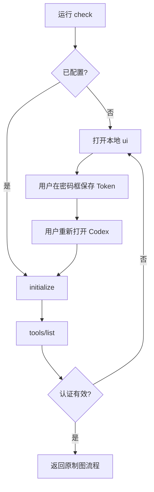

# 设置工作流

## 状态机



## 命令

从已安装插件根目录执行：

```bash
python3 scripts/processon_setup.py check
python3 scripts/processon_setup.py ui
```

浏览器不可用时使用隐藏终端输入：

```bash
python3 scripts/processon_setup.py setup
```

`check` 只会输出 `configured` 或 `missing`。`ui` 仅监听随机 loopback 端口，十分钟后自动关闭。`setup` 使用隐藏输入，不把值放进命令历史。

## 异常处理

| 信号 | 用户说明 | 下一步 |
|---|---|---|
| missing | “当前用户尚未配置 ProcessOn，请完成本地三步设置。” | 打开 `ui` |
| 保存失败 | “本地凭证未保存，请检查当前用户配置目录权限。” | 保留原凭证并重试设置 |
| `PROCESSON_AUTH_REQUIRED` | “ProcessOn 凭证无效或已过期，请在本地页面更新。” | 进入轮换 |
| MCP 暂不可用 | “凭证已配置，但服务连通性尚未验证。” | 不重复生成，稍后只读检查 |

不要使用“请提供更多信息”这类笼统提示。缺少什么、用户在哪里操作、完成后如何验证，都要明确列出。
